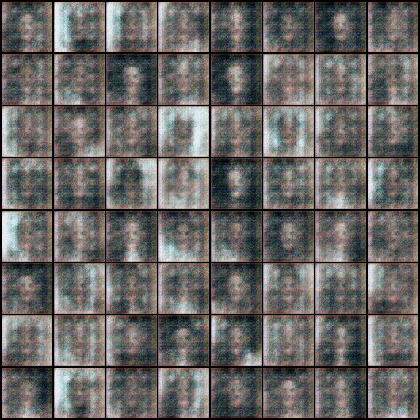

Deep Convolutional Generative Adversarial Networks are a class of CNN and one
of the first approaches that made GANs stable and usable for learning
features from images in unsupervised learning. This project is a port of the
[pytorch/examples/dcgan](https://github.com/pytorch/examples/tree/master/dcgan).
At the end of this example you will be able to use DCGANs for generating images
from your dataset.



In this guide we will train a [Pytorch](http://pytorch.org/) model in an
unsupervised task and use it to generate images from an input vector Z(100
dimensional uniform distribution). Finally, we will deploy the trained model as
a REST endpoint that can be used to generate images in real time.

## Project setup

The code for this project is available on this [GitHub
repository](https://github.com/ReDeiPirati/dcgan.git). Once [logged
in](../commands/login), clone the project and [initialize](../commands/init) a
floyd project.

```bash
$ git clone https://github.com/floydhub/dcgan.git
$ cd dcgan
$ floyd init dcgan
```

## Training

### Dataset

For this project we will use the [Labeled Faces in the Wild Home](http://vis-www.cs.umass.edu/lfw/), aka LFW, for the training.
Since we are learning in an unsupervised regime, there is not a train/dev/test split, but we use the BCE Loss Error of the Discriminator and Generator as good metrics to learn (minmax game strategy from Game Theory). Moreover, we can visualize the generated images every epoch.
This preprocessed dataset is available publicly on
[FloydHub](https://www.floydhub.com/redeipirati/datasets/lfw/).

### Training

You can train the DCGAN model by running `main.py` script with required
parameters. Below is the [command](../commands/run) to start the training job on Floyd:

```bash
$ floyd run \
--gpu \
--env pytorch-0.2 \
--data redeipirati/datasets/lfw/1:lfw \
"python main.py --dataset lfw --dataroot /lfw --outf /output --cuda --ngpu 1 --niter 20"
```

Notes:

- `--gpu` ensures the job will run on a GPU server.
- `--env pytorch-0.2` ensures the job will be run in FloydHub's `pytorch-0.2`
  environment.
- The input dataset is passed using `--data redeipirati/datasets/lfw/1:lfw`.
  This mounts the pre-processed LFW dataset (available
  [here](https://www.floydhub.com/redeipirati/datasets/lfw/1) under FloydHub
  user [@redeipirati](https://www.floydhub.com/redeipirati)'s account) at
  `/lfw`. Also note that `main.py`'s `--dataroot` flag specifies `/lfw` as the
  path where the data will be available. This ensures that the
  [code knows where to find the dataset](../getstarted/core_concepts/#connecting-code-and-datasets).

This job takes about 20 minutes to run and generate a model. You can follow along the progress
by using the [logs](../commands/logs.md) command. If you run the model with default value it will take about 1-5 minutes per epoch.

```bash
$ floyd logs <JOB_NAME> -t
```

Floyd saves any content stored in the `/output` directory at the end of the
job. This output can be used as a datasource in the next project. To get the
name of the output generated by your job use the [info](../commands/info.md)
command.

```bash
$ floyd info <JOB_NAME>
```


## Evaluating

To evaluate your model you can run the
[`generate.py` script included in the GitHub repository](https://github.com/ReDeiPirati/dcgan/blob/master/generate.py).
The script needs the path of a checkpoint Generator model, which you pass to
the script using its `--netG` flag. Just make sure that you mount the
checkpoint Generator model at the path you pass to the `--netG` flag. Below, we
mount the model at `/model`. You can also provide a serialized Zvector
(`--Zvector`) to experiment with latent Z vector arithmetic landscape and for
analyzing the semantic information encoded during training.

```bash
floyd run \
--gpu \
--env pytorch-0.2 \
--data <REPLACE_WITH_JOB_OUTPUT_NAME>:model \
"python generate.py --netG /model/<REPLACE_WITH_MODEL_CHECKPOINT_PATH> --ngpu 1 --cuda"
```

```bash
# Provide a serialized Zvector
floyd run \
--gpu \
--env pytorch-0.2 \
--data <REPLACE_WITH_JOB_OUTPUT_NAME>:model \
"python generate.py --netG /model/<REPLACE_WITH_MODEL_CHECKPOINT_PATH> --Zvector /model/<REPLACE_WITH_SERIALIZED_Z_VECTOR_PATH> --ngpu 1 --cuda"
```

You can track the status of the run with the status or logs command.

```bash
$ floyd status <JOB_NAME>
$ floyd logs <JOB_NAME> -t
```


## Improving your model

You may notice that the output does not look great. In fact, the algorithm has
not yet learned how to correctly represent a face.  That is because we ran the
training for a small number of iterations. To train a fully working model, try
the training step again, this time setting the flag `--niter` to a large value,
such as 300. In general, about 300/500 epochs (or even more, much more!) are
necessary to have an accetable model. (Note: This takes a few hours to run on
the GPU instance!)
Keep in mind that *all the classes of generative networks are neither stable
nor production ready*, this is an exciting field of research and everyone can
contribute with new ideas.

## Evaluate pre-trained models

If you want to try out a pre-trained model, FloydHub has a public dataset model
with the checkpoints (300 epochs training) for this located [here](https://www.floydhub.com/redeipirati/datasets/dcgan-300-epochs-models/1). You can mount it with
`--data redeipirati/datasets/dcgan-300-epochs-models/1:/model`.

```bash
floyd run \
--gpu \
--env pytorch-0.2 \
--data redeipirati/datasets/dcgan-300-epochs-models/1:/model \
"python generate.py --netG /model/netG_epoch_299.pth --ngpu 1 --cuda"
```

This model should perform better compared to the previous one. You can also provide the `--Zvector` parameter to explore the latent Z vector landscape. We have also provided to you the zvector used for evaluating our model in the attached dataset:

```bash
floyd run --gpu \
--env pytorch-0.2  \
--data redeipirati/datasets/dcgan-300-epochs-models/1:/model \
"python generate.py --netG /model/netG_epoch_299.pth --Zvector /model/zvector.pth --ngpu 1 --cuda"
```

## Serve the Model with a REST API

FloydHub supports seving mode for demo and testing purposes. Before serving
your model through a REST API, you need to create a `floyd_requirements.txt`
and declare the `flask` requirement in it. If you run a job with `--mode serve`
flag, FloydHub will run the `app.py` file in your project and attach it to a
dynamic service endpoint:

```bash
floyd run \
--gpu \
--mode serve \
--env pytorch-0.2 \
--data <REPLACE_WITH_JOB_OUTPUT_NAME>:input
```

The above command will print out a service endpoint for this job in your terminal console.

The service endpoint will take couple minutes to become ready. Once it's up, you can interact with the model by sending a serialized Zvector file with a POST request or simply generate images from random noise with a GET request(you can also use the `ckp` parameter to chose a specific checkpoint):

```bash
# e.g. of a GET req
curl -X GET -o <NAME_&_PATH_DOWNLOADED_IMG> -F "ckp=<MODEL_CHECKPOINT>" <SERVICE_ENDPOINT>
curl -X GET -o prova.png -F "ckp=netG_epoch_99.pth" https://www.floydhub.com/expose/hellllllllo!!!!

# e.g. of a POST req
curl -X POST -o <NAME_&_PATH_DOWNLOADED_IMG> -F "file=@<ZVECTOR_SERIALIZED_PATH>" <SERVICE_ENDPOINT>
curl -X POST -o prova.png -F "file=@./parameter/zvector.pth" https://www.floydhub.com/expose/hellllllllo!!!!
```

Any job running in serving mode will stay up until it reaches maximum runtime. So
once you are done testing, **remember to shutdown the job.**

*Note that this feature is in preview mode and is not production ready yet*

## What Next?

In the original paper the model was trained on the
[LSUN](http://www.yf.io/p/lsun) dataset, and then the learned features were
used to perform an image classification task on the CIFAR-10 dataset. DCGAN was
one of the first stable models based on GAN and the first which tried to
learn features from images in an unsupervised regime. GAN is an extremely
active research area because they can provide an unlimited amount of high
quality data which is necessary to train Deep Learning models.

{!contributing.md!}
