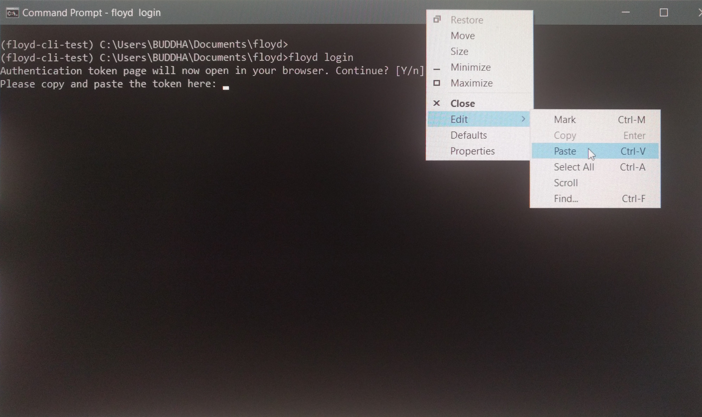
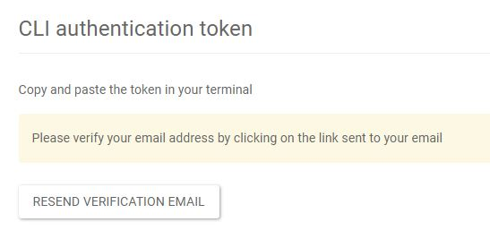

## Login

### Windows

### I get "Invalid Token" error on my Windows 10 machine when I run floyd login.

If you are using Windows command shell, there is an issue with pasting the token using the 
standard `Ctrl + V` shortcut. You need to use the Shell's Edit menu to paste the token. After copying the token from the browser, right click on the top bar of the command shell and select Edit -> Paste. See image below:

### I still get the "Invalid Token" error after trying the above suggestion.

In some windows shells (like Git Bash) there is an extra space added to the token field
before you paste the token. So you need to hit Backspace and clear out the field before pasting 
the token. So the steps are:

1. Type `floyd login` in the console.
2. From the FloydHub web page, select the token and click on the "Copy to clipboard" button.

3. In the console, hit "backspace" a few times to remove the extra characters from the token login prompt request.
4. Right click on the menu bar, and select "Edit", and then "Paste"
5. Then press "Enter"

You should be able to login successfully now. If it's still not working, please give it a try on powershell.

## Signup

### How does the free CPU / GPU hours work?

Every one who signups to Floydhub will receive 2 hours of free CPU / GPU time
for running your projects. We hope this will give you enough time to evaluate
Floydhub for your needs. We are working on a new free plan right now to better
help new users explore the platform.

### Email Verification

After you signup on FloydHub, you have to verify your email address. You will receive an automated email from Floyd with a link that you can click to verify.

### I did not receive my verification email

As soon as you sign up on FloydHub, you should receive an automated email in your inbox with instructions to verify your email address. 

If you do not receive an email within a few minutes:

- Please check your spam folder. If the email is there, please "Mark as not Spam" to avoid this happening in the future
- If you still don't receive an email, please try resending the verification email by clicking on "Resend Verification Email" at [floydhub.com/settings/security](https://www.floydhub.com/settings/security)

- If this still doesn't work, it is likely that your mail server (e.g. your work email server) is filtering out our emails. Please check with your email adminstrator to allow emails from the *floydhub.com* domain.

{!contributing.md!}
