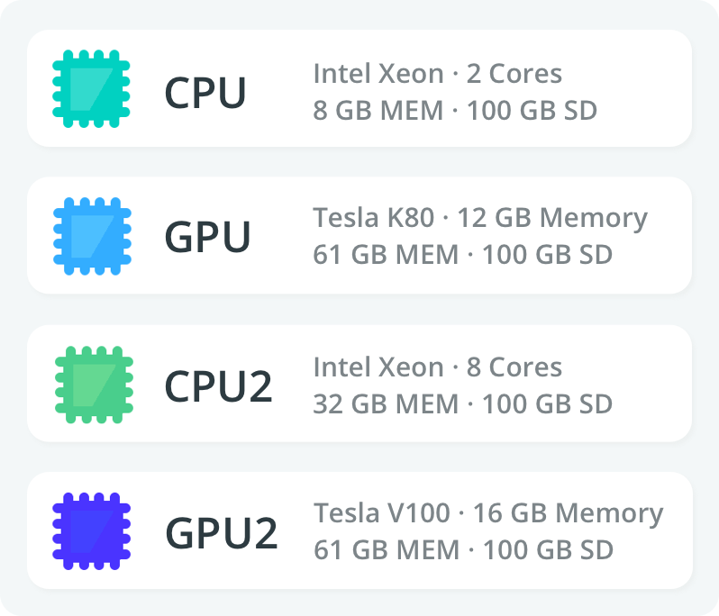

### How can I automate a process that involves FloydHub?

We have a python SDK that can be used to automate your FloydHub workflow. The *sdk is in alpha* - so we are giving access to folks who are interested in using this and giving feedback. If you need any features, we are happy to work with you on that. Let us know if you are interested in alpha testing the sdk.

You can also see how one of our customers automated their FloydHub workflow in our [blog post](https://blog.floydhub.com/automate-floydhub-with-celery/).

### How can I ssh into the remote machine?

We don't support ssh access to the remote instance at the moment. However, you can connect to the machine using your browser: [Workspaces](../guides/workspace) are interactive environments where you can run notebooks and scripts. You will also have [terminal](../guides/workspace/#using-terminal) access here.

### Can I close my laptop during the training?

#### Command jobs
When you submit [command jobs](../guides/run_a_job/), your code is uploaded to FloydHub and training is started in the cloud. You can close the browser or shutdown your machine and the job running in the cloud will not be affected. You can monitor the job anytime from the website and view the logs and metrics in realtime. When the training script ends it will be shutdown automatically by FloydHub.

#### Workspaces
[Workspaces]((../guides/workspace)) are interactive development environment. You can run jupyter notebooks and python scripts here. When running jupyter notebooks, you have to keep your browser tab open and connected to the internet to receive the output of your code cells. If you close your browser when your code cell is executing, you will lose the output printed by the cell but the code will continue to run. When you re-open the browser tab, the output of the code cell will be empty.

This is an artifact of Jupyter Notebooks:

*"Anything already running in the notebook will keep running, and the kernel it started for that will stay running - so it won't lose your variables. However, any output produced while the notebook isn't open in a browser tab is lost; there isn't an easy way to change this until we have the notebook server able to track the document state, which has been on the plan for ages."*  - Jupyter Team

#### Workarounds

Here are some workarounds that you can use:

- Send all the output of your jupyter notebook to a log file that you can inspect anytime. You can also consider [redirecting the std error](https://stackoverflow.com/questions/34145950/is-there-a-way-to-redirect-stderr-to-file-in-jupyter) and/or the [std output to a log file](https://stackoverflow.com/questions/4675728/redirect-stdout-to-a-file-in-python).

```python
def mylogger(message):
    # Logging message to a log file (e.g. <your_notebook_name>.log)


# Inside the Code Cells
mylogger('Preprocessing')
mylogger('Start training')
...
mylogger('End of Notebook')
```

- Send metrics to [Tensorboard](../guides/jobs/tensorboard/) - this way you will be able to view the training results later even if the code cell output is lost.
- Convert your notebook to a python script and run the Job in command mode. You can also run a notebook directly from [Terminal](../guides/workspace/#using-terminal) or as a CLI Job with the `jupyter nbconverter`  command.

```bash
# Terminal
$ jupyter nbconvert --execute --to notebook --inplace --ExecutePreprocessor.timeout=-1 <notebook_to_execute>

# CLI Job
$ floyd run ... 'jupyter nbconvert --execute --to notebook --inplace --ExecutePreprocessor.timeout=-1 <notebook_to_execute>'
```

This command will executed your notebook and replace the output of the notebook with the new one at the end of the execution. The [timeout](https://nbconvert.readthedocs.io/en/latest/config_options.html) was disabled for simplicity.

For more about `nbconverter` see the related [docs](https://nbconvert.readthedocs.io/en/latest/index.html).

### Which type of machines do you provide?

CPU and CPU2 machines do not have a GPU.
GPU and GPU2 machines will come with both CPU and GPUs.

Here is the full list of all the machine types we offer and the hardware specifications:



You can find the price for each machine in the [pricing page](https://www.floydhub.com/pricing#powerups).

We are also planning to introduce new machines soon (multi-gpus, TPUS etc...). If you need a custom setup, please reach us via the chat bubble or email us at support@floydhub.com.

### Where is your datacenter located?

We have only a datacenter that is located in Oregon, USA.


We have plans to add new datacenters in Europe and Asia in the future. Let us know if you need that for your projects.

### How can I automate my script to recognize that is running on FloydHub?

All our environments come with a variable with this purpose: `FLOYDHUB=1`. Here's a code snippet that you can apply in your scripts:

```python
import os

if os.environ.get('FLOYDHUB'):
	# Running on FloydHub
else:
	# Running locally or in other platforms
```

### Encoding issue

_This is a common issue between **Windows users**_: it could happens that your Terminal is using a different encoding from the one expected from the remote machine. Here are some examples:
    
1. Slash and single quote issue: `floyd run \ --data alice/datasets/test \  'python test_Sony.py'` is translated as `floyd run --data alice/datasets/test '\ \ \ \ '"'"'python test_Sony.py'"'"''`  
2. Double quotes issue: `floyd run "python test_Sony.py"` is translated as `floyd run  ''"'"'python test_Sony.py'"'"''`

 Unfortunately, there isn't a silver bullet, but you can use the `Command` view of the Job's Overview page to help at debugging it. More in general, if you will notice this issue, you can try to switch single quotes with double or viceversa, and remove the slash if you are indenting the commands on multiple lines - these usually fix the issue in 99% of the case. If it will not be the case, please reach out us at support@floydhub.com.