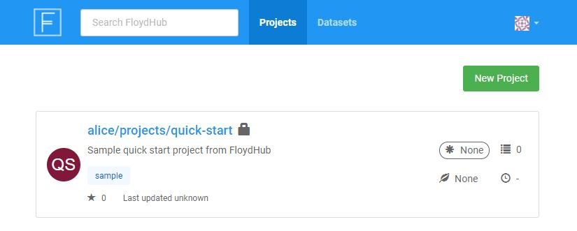
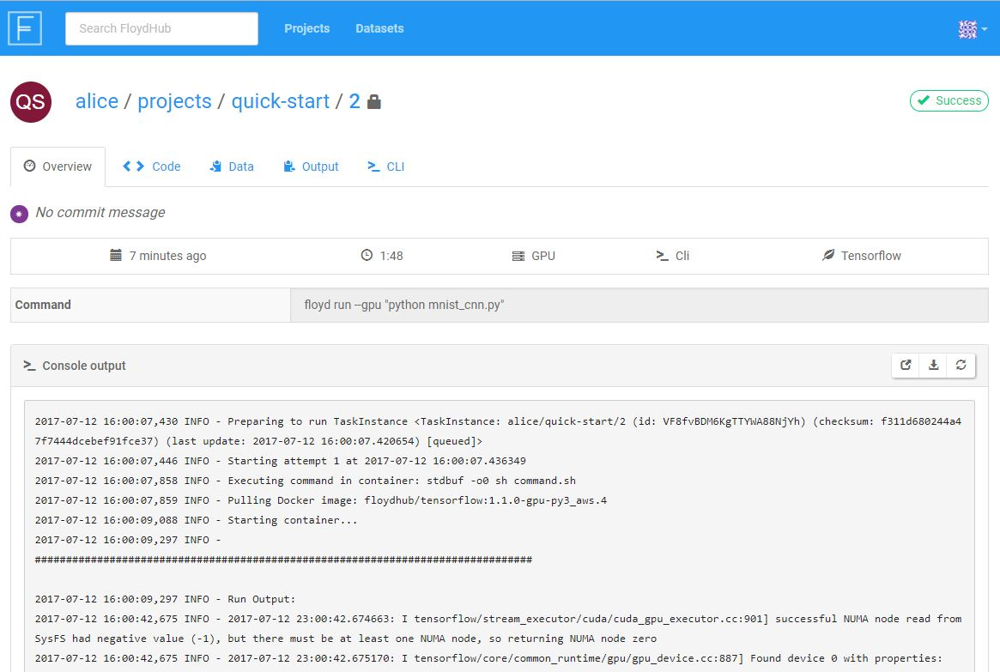
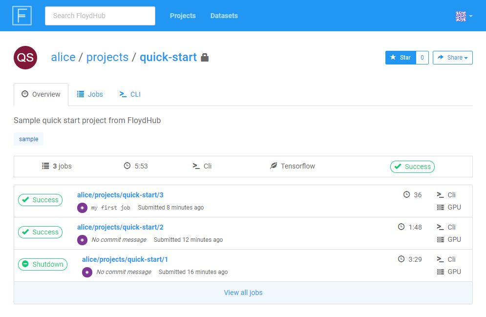

## Introduction

With this tutorial, you'll get acquainted with FloydHub and learn the
basics necessary to get up and running on the platform.

We'll start with an overview of FloydHub and then jump into training your first
deep learning model on FloydHub using TensorFlow and the MNIST dataset (better
known as the "Hello, world!" of data science). We'll be training a
convolutional neural network (CNN) model to recognize hand-written digits using
FloydHub's GPU servers. For more details on the data and the model, please
refer to the [TensorFlow
documentation](https://www.tensorflow.org/get_started/mnist/pros).

## Quick Preparation Checklist
- [Create a FloydHub account](https://www.floydhub.com/login)
- [Install `floyd-cli` on your computer](../guides/basics/install.md)
- [Log in to FloydHub through `floyd-cli`](../guides/basics/login.md)

## Create a New Project
First, we'll need to [create a project](../guides/basics/create_new). All the
[jobs](../getstarted/core_concepts/#jobs) we run while training our model will
be grouped under this project, and we'll be able to go back and review each job
later. For more information about projects, check out our [Core Concepts
page](../getstarted/core_concepts/#projects).

To create the project, visit [www.floydhub.com/projects](), and click the
`New Project` button in the top right corner of the screen. Complete the form
to create a new project. (Note that private projects are only available on our
[Data Scientist Plans](https://www.floydhub.com/pricing).)

If you're a new user, then you should already see a default project named
`quick-start` in your [projects dashboard](https://www.floydhub.com/projects). If you don't see it, go ahead and create a project named 'quick-start'.

When you visit [www.floydhub.com/projects]() you should see your quick-start
project, as shown below:



### Initialize the Project on Your Machine

Now that we've created the project on FloydHub, we can use Floyd CLI to start
getting some deep learning done. We'll start by initializing our quick-start
project on our local machine.

#### Clone the quick-start Repo from GitHub

If you were writing code from scratch, you would create a new directory on your
computer and initialize the FloydHub project in there. In this quick start,
we'll clone an existing GitHub repository and use its code. Clone the
[quick-start repository](https://github.com/floydhub/quick-start) from GitHub
onto your computer, and change directories into it:

```bash
$ git clone https://github.com/floydhub/quick-start.git
Cloning into 'quick-start'...
...
$ cd quick-start
$ ls
eval.py  LICENSE  mnist_cnn.ipynb  README.md  train_and_eval.py  train.py
```

This repository contains a file we'll use to get started: `train.py`.
It's a Python script that trains a convolutional neural network model against
the MNIST dataset. Feel free to look through the file if you'd like, but you
don't need to.

#### Initialize the Project Locally

To "initialize" a FloydHub project on your machine
means to run the `floyd init <name_of_project>` command in your project's
directory. This will create some files in the directory that Floyd CLI uses to
keep track of your jobs and sync with floydhub.com.

Let's initialize our project inside of the directory we just cloned from
GitHub:

```bash
$ floyd init quick-start
Project "quick-start" initialized in the current directory
```
Success!

## Get the Dataset

To run our deep-learning script, we'll need to give it access to the MNIST
dataset. You probably know that the MNIST dataset is actually available within
the TensorFlow package itself, but for the purposes of this tutorial we have
separated out the dataset so you can get a feel for what it's like to work
with datasets on FloydHub. We have the MNIST dataset pulicly available on
FloydHub [here](https://www.floydhub.com/mckay/datasets/mnist).

!!! note

    On FloydHub, datasets are kept separate from your project/code. This
    approach serves two main purposes:

    - **Upload data only once**: Datasets are usually big, so we don't want to
      have to upload them each time we run our code.
    - **Enable collaboration**: When datasets are kept separate from code, team
      members and communities can more easily work on projects together.

    If you'd like more information on keeping data separate from code, check out
    [this section](../getstarted/core_concepts/#why-keep-datasets-separate-from-code)
    of our Core Concepts page.

When you start working on your own projects, you'll eventually want to upload
your own dataset. Check out
[this article](../../guides/create_and_upload_dataset) to learn how to do that.

## Running Your First Job

Now that we have our project created and our dataset ready, let's run our first
job and train our model! A [job](../getstarted/core_concepts/#jobs) is an
execution of your code on FloydHub's deep-learning servers. To kick off a job,
we use the `floyd run` command.

Run the command below to kick off the training job. (Don't worry, we'll explain
each piece of the command.)

```bash
$ floyd run \
--gpu \
--data mckay/datasets/mnist/1:/mnist \
--env tensorflow-1.3 \
"python train.py"

Creating project run. Total upload size: 25.4KiB
Syncing code ...
[================================] 27316/27316 - 00:00:00

JOB NAME
----------------------
alice/projects/mnist/1

To view logs enter:
   floyd logs alice/projects/mnist/1
```

Congratulations! Your first job is now running on FloydHub's GPU servers.
Behind the scenes, FloydHub does the following:

- Syncs your local code to FloydHub's servers
- Provisions a GPU instance on the cloud (because you set the `--gpu` flag)
- Sets up a deep learning environment with GPU drivers and TensorFlow 1.3
  installed (because you set the enviroment flag to `--env tensorflow-1.3`)
- Executes the command `python train.py` inside this environment
- Stores the output logs and generated output data
- Terminates the GPU instance once the command finishes execution

Here is quick explanation of each part of the command you just ran:

### floyd run

Tells the CLI we want to run a job.  You'll use this command to run all of your
jobs. [More info here](../../guides/run_a_job/#instance-type).

### --gpu

Specifies that we want our job run on a GPU server. More info
on instance types [here](../../guides/run_a_job/#instance-type).

### --data mckay/datasets/mnist/1:/mnist

The `train.py` script expects the [MNIST
data](https://www.floydhub.com/mckay/datasets/mnist/1) to be located at
`/mnist` on the computer where the script runs. We can use the `--data` flag to
ensure that our dataset is available to our code at `/mnist`.

We pass the `--data` flag the name of our dataset (`mckay/datasets/mnist/1`)
and the location on the server where we want our dataset to be available
(`/mnist`), separated by a colon (`:`).

Putting that all together, we get:

```
--data mckay/datasets/mnist/1:/mnist
```

We have an entire article in our docs about mounting datasets to your jobs.
When you're ready to dive in, take a read through it [here](../../guides/data/mounting_data)

### --env tensorflow-1.3

Ensures our job is run on a server that has TensorFlow 1.3 installed. More info
on job environments [here](../../guides/run_a_job/#environment)

### "python train.py"

The command we want the server to execute to kick off our code. More info
on how to specify commands [here](../../guides/run_a_job/#command_1).

## Monitoring Your Job

You can view the status of your job from your terminal using the
[`floyd status`](../commands/status.md) command. You can specify a single job
name (e.g. `floyd status alice/quick-start/1`) to get its status, or the
`floyd-cli` will show the status of all jobs in the current project.

```bash
$ floyd status
JOB NAME             CREATED        STATUS    DURATION(s)  INSTANCE    DESCRIPTION
-------------------  ---------      --------  -----------  ---------   -----------
alice/quick-start:1  just now       running            15  gpu
```

You can also view the status of your job in your browser by visiting the `Job
URL` printed by the `floyd run` command. For example,
`https://www.floydhub.com/alice/quick-start/1`. The page should look something
like this:



## Viewing Your Job's Logs

It's easy to view the logs generated by the job from your terminal with the [floyd logs](../commands/logs.md) command. You'll need to specify the job name in the command.

```bash
$ floyd logs -t alice/quick-start/1
...
2017-07-12 16:00:07,446 INFO - Starting attempt 1 at 2017-07-12 16:00:07.436349
2017-07-12 16:00:09,088 INFO - Starting container...
2017-07-12 16:00:09,297 INFO -
...
##############################################################################
2017-07-12 16:00:09,297 INFO - Run Output:
2017-07-12 16:01:46,154 INFO - Successfully downloaded train-images-idx3-ubyte.gz 9912422 bytes.
2017-07-12 16:01:46,158 INFO - Iter 1280, Minibatch Loss= 39855.289062, Training Accuracy= 0.17969
2017-07-12 16:01:46,159 INFO - Iter 2560, Minibatch Loss= 14964.132812, Training Accuracy= 0.42969
...
##############################################################################
...
```

The output of your code is printed in the `Run Output` section of the logs,
between the `#########` lines. Anything you log or print in your code will
appear here, so this is a great way to monitor the progress of your model
training command. In our `quick-start` project, we're logging the training
accuracy of our model.

Using the `-t` (tail) flag will stream the logs as they are generated.

You can also view the logs in your browser using your `Job URL`. (The `Job URL`
will look something like
`https://www.floydhub.com/<username>/projects/quick-start/<job_number>`.)

## Storing Your Model for Future Use

We want to save the model we trained so we can use it later, maybe to iterate
on it or to check its accuracy using an evaluation script.

To save something during our job that we want to save for later, we just need
to make sure it gets saved at `/output` during our job. Anything in `/output`
at the end of a job will be saved for us and we can reuse it later.  Take a
look at [line
108](https://github.com/floydhub/quick-start/blob/master/train.py#L108) of our
`train.py` script. Here's the line:

```
builder = tf.saved_model.builder.SavedModelBuilder("/output/cnn_model")
```
We're setting up our model to be saved under `/output`. This ensures that
FloydHub will save it for us to use later.

For more details on how to save and reuse job output, see
[this article](../../guides/data/storing_output).

Now let's evaluate our model by checking it against our evaluation script.

## Evaluate Your Model

To finish off this tutorial, we'll evaluate the model we trained in our first
job. The repository we cloned early has a script we can use to do this:
`eval.py`.

The script expects our model to be located at `/model` on the machine where the
script runs. Somehow we've got to make sure that the model we saved in our
first job ends up at that location during our second job. FloydHub allows us to
reuse a job's output in another job, and to specify the place the data will be
located during the second job. The method to accomplish this is the same one we
used to mount our dataset to our first job. We'll demonstrate how to mount our
model in the next section.

### How to Reuse the Output of Your Previous Job

Output from previous jobs can be attached to a new job using the same approach
as mounting a dataset. We just use the name of the output instead of the name
of a dataset when we use the `--data` flag:

```
--data alice/projects/quick-start/1/output:/model
```

Notice that we specify `/model` as the mountpoint because we know our
evaluation script expects our model to be at `/model`.

For more information on reusing output, check out
[this article](../../guides/reusing_output)

### Run Your Second Job

Follow this command to run your second job. Note that we are mounting our
dataset again at `/mnist` and also mounting our model at `/model`. Be sure to
replace `mckay/projects/quickstart/1/output` with the name of the output you
want to mount (something like `<username>/projects/quick-start/<run_number>/output`)

```

$ floyd run \
--gpu \
--env tensorflow-1.3 \
--data mckay/datasets/mnist/1:/mnist \
--data alice/projects/quick-start/1/output:/model \
'python eval.py'

Creating project run. Total upload size: 26.3KiB
Syncing code ...
[================================] 28620/28620 - 00:00:01

JOB NAME
---------------------------
mckay/projects/quick-start/2

To view logs enter:
   floyd logs mckay/projects/quick-start/2
```

You know how to check the logs, so go ahead and check the logs of your second
job and see how accurate your model is!

If you forgot how to check the logs, take a look at [this
section](#viewing-your-jobs-logs) of the page.

## Iterating on Your Model

Congratulations! You've trained and tested your first model on FloydHub 🎉

At this point, you can edit your Python code locally to make improvements or
adjustments to your training script, and then kick off a new job with the
[floyd run](../commands/run.md) command. The `floyd-cli` will upload the newest
versions of your code and submit another job to the FloydHub servers. Along the
way, FloydHub will be managing and tracking of all the iterations of jobs
within your project.

You can always view details on all of the jobs in your current project with the
`floyd status` command from your terminal, or by visiting the `Project URL` in
your browser.

Example: `www.floydhub.com/alice/quick-start`



{!contributing.md!}
