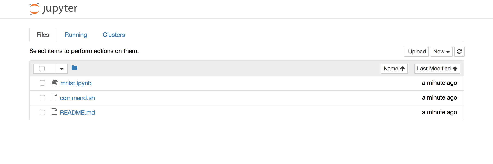
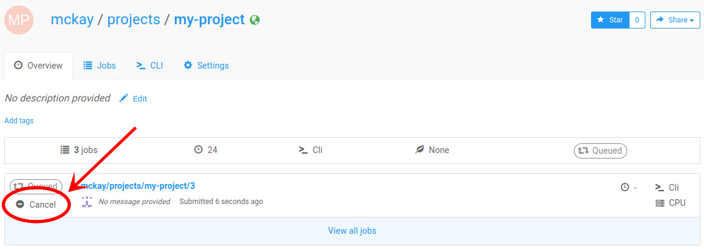
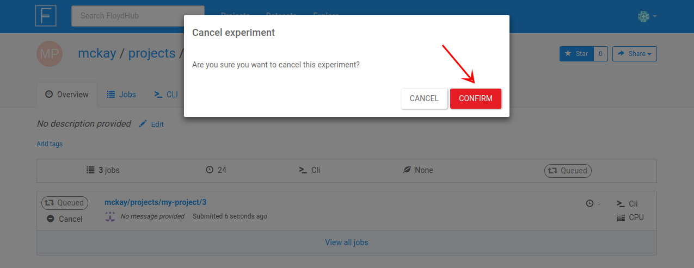

In this tutorial, we will run a Python [Jupyter Notebook](http://jupyter.org/) on FloydHub. Notebooks allow you to create and share documents that contain live code, visualizations and explanatory texts. This is an [example Notebook](https://github.com/floydhub/quick-start-pytorch/blob/master/mnist.ipynb). It is great for interactively writing and debugging your code and visualizing your results and data.

Similar to the [Quick Start guide](./quick_start.md), we will train a CNN model for handwritten digit recognition using PyTorch and the MNIST database.

If you are new to FloydHub, please ensure you have followed the [Quick Start guide](./quick_start.md) first. It introduces some important concepts used in this tutorial.

## What we will accomplish in this guide

- Learn how to create a new project on FloydHub
- Start a Jupyter notebook on FloydHub's GPU server
- Interactively run and debug your code
- Mount datasets to use in your code

## Quick preparation checklist

- You must have a [FloydHub account](https://www.floydhub.com/login)
- You must have `floyd-cli` [installed on your computer](../guides/basics/install.md)
- You must [log in to FloydHub through the CLI](../guides/basics/login.md)

## Setup

### Create a new project
For this tutorial, we will create a new Project. This project will be a collection of the jobs you run and their data, logs and results.

To create a new Project, visit [www.floydhub.com/projects](https://www.floydhub.com/projects) and click on the "New Project" button on the top right hand corner.


We will name this project `mnist-pytorch`. Feel free to provide an apt description.

The `Visibility` field indicates who can see your project. If you set it to `Public`, anyone can see your project, your code and data. If you are working on an open source project, this is a great way to share and contribute to the FloydHub community. If your code or data is proprietary, please select `Private`. This will ensure that only you and your team will have access to this project.

### Get the code
We will clone the [quick-start repository](https://github.com/floydhub/quick-start-pytorch) from Github to your local machine and run it on FloydHub. Run the `git clone` command in a brand new directory on your computer:

```bash
$ git clone https://github.com/floydhub/quick-start-pytorch.git
Cloning into 'quick-start-pytorch'...
$ cd quick-start-pytorch
```

```bash
$ ls
$ README.md mnist.ipynb
```

In this guide, we will use the `mnist.ipynb` Jupyter Notebook.

### Initialize new project
Now that we have the code, we want to associate this directory with the new project you just created on FloydHub. Ensure that you are inside the `quick-start-pytorch` directory and execute:

```bash
$ floyd init mnist-pytorch
Project "mnist-pytorch" initialized in the current directory
```

This tells Floyd that all the jobs run from this directory belong to the same project.

## Running Jupyter Notebook on FloydHub

Starting a Jupyter Notebook on FloydHub is very simple. Use the [floyd run](../commands/run.md) command with `--mode jupyter` flag.

Execute the following command from the command line:

```bash
$ floyd run --mode jupyter --gpu --env pytorch-0.2
Creating project run. Total upload size: 21.9KiB
Syncing code ...
[================================] 23333/23333 - 00:00:00
NAME
--------------------
saip/projects/mnist-pytorch/3

Setting up your instance and waiting for Jupyter notebook to become available ..............

Path to jupyter notebook: https://www.floydhub.com/notebooks/pCoPyzZtYeo6mE9PpSWsmY
```

This will take a little bit. As it executes, Floyd is doing the following behind the scenes:

- Sync your local code to FloydHub's server
- Provision a GPU instance on the cloud (if you want CPU, drop the `--gpu` flag)
- Set up an deep learning environment with PyTorch installed (because `--env pytorch`)
- Start a Jupyter server on the cloud, and open the url in your browser

You can also open the link to the your Jupyter dashboard using the displayed URL. For example:



Open the `mnist.ipynb` Notebook and start training your model interactively!

## Next steps

### Check the status of your job

You can view the job's status by going to the job's page in the web dashboard:


Alternatively, you can view the status from your terminal using the
[`floyd status`](../commands/status.md) command:

```bash
$ floyd status saip/mnist-pytorch/projects/3
JOB NAME                CREATED         STATUS      DURATION(s)  INSTANCE    DESCRIPTION
----------------------  --------------  --------  -------------  ----------  -------------
saip/mnist-pytorch/projects/3    16 minutes ago  running               0  gpu
```

### Stopping your Notebook

On the project page, click the `Cancel` button below the icon that shows the status of your job, as shown in the picture below:



Then click the `Confirm` button in the modal that pops up:


!!! warning
    Jupyter Notebooks are designed for interactive development. Your job starts running on FloydHub's server when you execute the `floyd run --mode jupyter` command and it continues to be active till you explicitly stop your job.

    Hence, even if you are not actively executing code inside your Notebook, the Jupyter server is still active on FloydHub and you are billed for the time.

### Learn More

For a more in-depth tutorial about FloydHub that uses FloydHub's "command
mode", check out [this tutorial](get_started).

{!contributing.md!}
