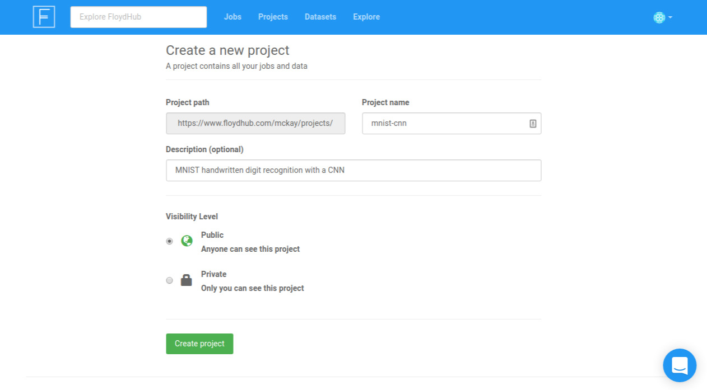

## Quick Preparation Checklist
- [Create a FloydHub account](https://www.floydhub.com/login)
- [Install `floyd-cli` on your computer](../guides/basics/install.md)
- [Log in to FloydHub through `floyd-cli`](../guides/basics/login.md)

## Quick Start

1. Visit https://www.floydhub.com/projects/create and create a FloydHub
    project. We'll call it `mnist-cnn`:
    

2. In your terminal, use `git` to clone FloydHub's
    [quick-start repository](https://github.com/floydhub/quick-start)
    repository. It contains the code we'll use to train our CNN. Clone it and
    switch directories into it:

    ```bash
    $ git clone https://github.com/floydhub/quick-start.git
    Cloning into 'quick-start'...
    ...
    $ cd quick-start
    $ ls
    eval.py  LICENSE  mnist_cnn.ipynb  README.md  train_and_eval.py  train.py
    ```

3. In your terminal, use Floyd CLI to initialize the project (be sure to use
   the name you gave the project in step one):

    ```
    $ floyd init mnist-cnn

    Project "mnist-cnn" initialized in current directory
    ```

4. Then, to run the training script on one of  FloydHub's deep-learning GPU
    servers, we'll use the following command:

    ```bash
    $ floyd run --gpu --env tensorflow-1.3 "python train_and_eval.py"

    Creating project run. Total upload size: 25.4KiB
    Syncing code ...
    [================================] 27316/27316 - 00:00:00

    JOB NAME
    ----------------------
    alice/projects/mnist-cnn/1

    To view logs enter:
       floyd logs alice/projects/mnist-cnn/1
    ```

    Here's what Floyd did when you ran that command:
    - Synced your local code to FloydHub's servers
    - Provisioned a GPU instance on the cloud (because you set the `--gpu` flag)
    - Sets up a deep learning environment with GPU drivers and TensorFlow 1.3
      installed (because you set the enviroment flag to `--env tensorflow`)
    - Executed the command `python train_and_eval.py` inside this environment
    - Stored the output logs and generated output data
    - Terminated the GPU instance once the command finished execution

5. View your job's logs using the `floyd logs -t` command:

    ```
    $ floyd logs -t alice/projects/mnist-cnn/1
    2017-09-27 14:14:40,364 INFO - Starting attempt 1 at 2017-09-27 14:14:40.358414
    2017-09-27 14:14:40,399 INFO - Downloading and setting up data sources
    2017-09-27 14:14:40,534 INFO - Pulling Docker image: floydhub/tensorflow:1.3.0-py3_aws.12
    2017-09-27 14:14:41,977 INFO - Starting container...
    2017-09-27 14:14:42,489 INFO -
    ################################################################################
    2017-09-27 14:14:42,489 INFO - Run Output:
    ...
    ```

    Be sure to use the `JOB NAME` that was printed out when you ran the `floyd
    run` command.

Congratulations! You've trained and tested your first model on FloydHub 🎉

Yeah, that was pretty high level. To get a bit more in depth and learn more
about what you actually just did, check out the [Getting Started
Tutorial](get_started)

{!contributing.md!}
