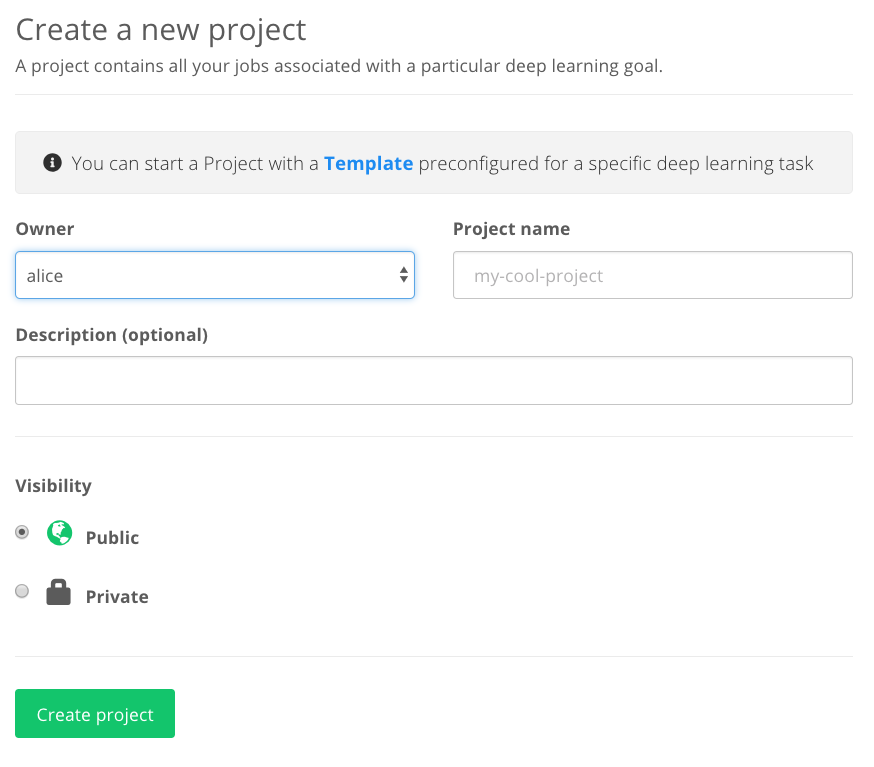

A [Project]() is a collection of the jobs you run along with their logs and
results. If you have used GitHub, projects in FloydHub are a lot like code
repositories.

To create a new Project, visit [www.floydhub.com/projects](https://www.floydhub.com/projects) and click on the "New Project" button on the top right hand corner.



Give the project a name and a description.

The `Owner` field defines the user space under which this project belong. If you are inside a Team select the name of your Team to create the project under the Team space.

The `Visibility` field indicates who can see your project. If you set it to `Public`, anyone can see your project, your code and data. If you are working on an open source project, this is a great way to share and contribute to the FloydHub community. If your code or data is proprietary, please select `Private`. This will ensure that only you and your team will have access to this project.

Once you have created a Project, you can start running jobs using the [floyd run](../../commands/run) command. For example, to start a CLI Job:

```bash
$ floyd init alice/quick-start
Project "quick-start" initialized in the current directory

$ floyd run --gpu --env tensorflow-1.9 'python train.py'
Syncing code ...
```

Let's make another example where Alice is a member of the `Wonderland` Team and want to run the same CLI Job of above inside the Team space:

```bash
$ floyd init wonderland/quick-start
Project "quick-start" initialized in the current directory

$ floyd run --gpu --env tensorflow-1.9 'python train.py'
Syncing code ...
```

### Adding a Project README

FloydHub will display a README file for your project, if you include a README file in your local code directory for a Project when you run a job. A good README file will help people on FloydHub understand your project, why it's useful, and how they can run the project.

To add a README to your Project, simply add a Markdown-styled text file to your project called `README.md` and FloydHub will automatically display that README file when you run your next job.


### Video Tutorial
#### Organizing your jobs with FloydHub Projects

<iframe width="560" height="315" src="https://www.youtube.com/embed/NTGIQ2iU_tc?rel=0" frameborder="0" gesture="media" allow="encrypted-media" allowfullscreen></iframe>
