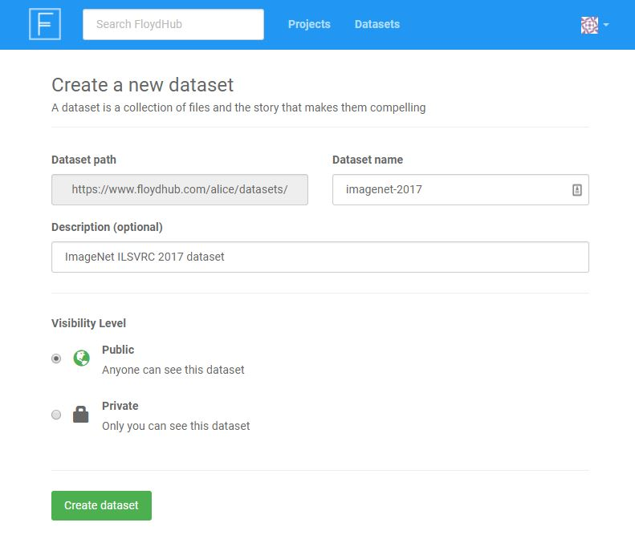

## Create a new Project

A [Project]() is a collection of the jobs you run and their data, logs and results. If you have used GitHub, projects in FloydHub are a lot like code repositories.

To create a new Project, visit [www.floydhub.com/projects](https://www.floydhub.com/projects) and click on the "New Project" button on the top right hand corner.


Give the project a name and an apt description.

The `Visibility` field indicates who can see your project. If you set it to `Public`, anyone can see your project, your code and data. If you are working on an open source project, this is a great way to share and contribute to the FloydHub community. If your code or data is proprietary, please select `Private`. This will ensure that only you and your team will have access to this project.

Once you have created a Project, you can start running jobs using the [floyd run](../../commands/run) command. For example, to start a Jupyter Notebook job:

```bash
$ floyd init quick-start
Project "quick-start" initialized in the current directory

$ floyd run --gpu --env tensorflow --mode jupyter
Syncing code ...
```


## Create a new Dataset

A [Dataset]() is a collection of data. If you have used Github, datasets in FloydHub are also a lot like code repositories, except they are for storing and versioning data.

To create a new Dataset, visit [www.floydhub.com/datasets](https://www.floydhub.com/datasets) and click on the "New Dataset" button on the top right hand corner.



Give the dataset a name and an apt description.

The `Visibility` field indicates who can see your dataset. If you set it to `Public`, anyone can see your dataset and data versions. If you are working on an open source project, this is a great way to share and contribute to the FloydHub community. If your data is proprietary, please select `Private`. This will ensure that only you and your team will have access to this dataset.

Once you have created a dataset, you can upload data from your terminal using the [floyd data](../../commands/data) command. For example:

```bash
$ floyd data init imagenet-2017
Dataset "imagenet-2017" initialized in current directory
...
$ floyd data upload
Compressing data...
```