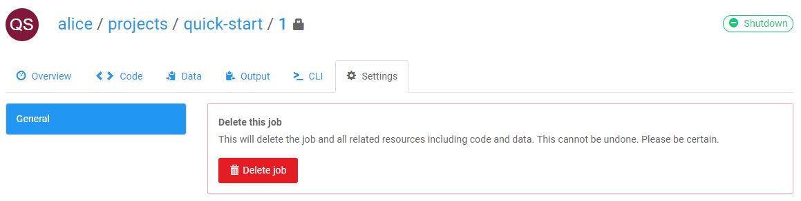
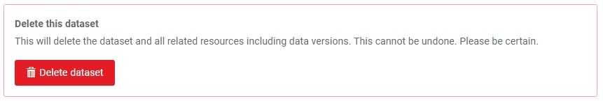
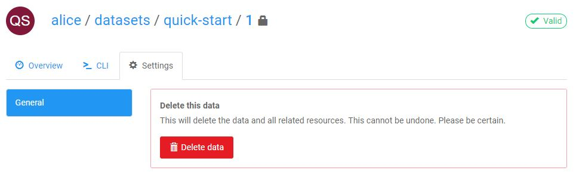

This guide explains how to delete Projects, Jobs, Datasets and Data.

## Deleting a Project

You can delete a project by clicking **Delete project** button on the Settings tab of the project on the web dashboard.

Example: `https://www.floydhub.com/alice/projects/quick-start/settings`


**Important**: Please note that deleting a project will delete all its jobs and their corresponding code, output data and logs. This *cannot* be restored. Please be absolutely sure you want to delete a project before proceeding.

We recommend deleting individual jobs rather than projects.

## Deleting a Job

You can delete an individual job by clicking on **Delete job** button on the Settings tab of the job's page on the web dashboard.

Example: `https://www.floydhub.com/alice/projects/quick-start/1/settings`



### Deleting a Job from CLI

You can also delete a job from the CLI using the [floyd delete](../../commands/delete) command.

```bash
$ floyd delete alice/projects/quick-start/1

Delete Run: alice/quick-start/1? [y/N]: y
Job BD4JMXSgCi2r2afbq3n3Vo: Deleted
```
## Deleting output of a Job

It is not possible to delete just the output of a job. You will have to delete the job itself.

## Deleting a Dataset

Deleting a Dataset is similar to deleting a Project. Click the **Delete dataset** button on the Settings tab of the dataset on the web dashboard.

Example: `https://www.floydhub.com/alice/datasets/quick-start/settings`




**Important**: Please note that deleting a dataset will delete all its individual versions of data. This *cannot* be restored. Please be absolutely sure you want to delete a dataset before proceeding.

We recommend deleting individual data versions rather than the entire dataset.

## Deleting a uploaded datasource

You can delete a particular version of a Dataset by clicking on **Delete data** button on the Settings tab of the data's page on the web dashboard.

Example: `https://www.floydhub.com/alice/datasets/quick-start/1/settings`



### Deleting an uploaded datasource from CLI

You can also delete an uploaded datasource from the CLI using the [floyd data delete](../../commands/data#floyd-data-delete) command.

```bash
$ floyd data delete alice/datasets/quick-start/1

Delete Data: alice/quick-start/1? [y/N]: y
Data alice/datasets/quick-start/1: Deleted
```