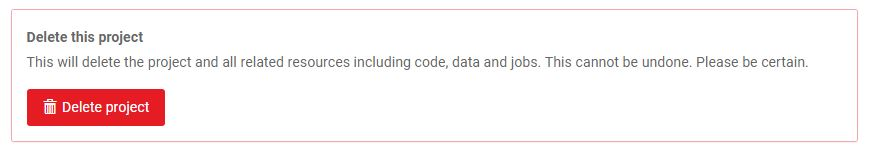

You can delete a project by clicking **Delete project** button on the Settings tab of the project on the web dashboard.

Example: `https://www.floydhub.com/alice/projects/quick-start/settings`

!!! important
    Deleting a project will delete all its jobs and their corresponding code,
    output data and logs. This **cannot** be restored. Please be absolutely
    sure you want to delete a project before proceeding.

We recommend deleting individual jobs rather than projects.
