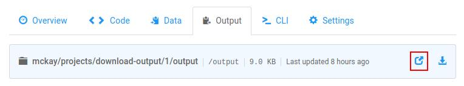
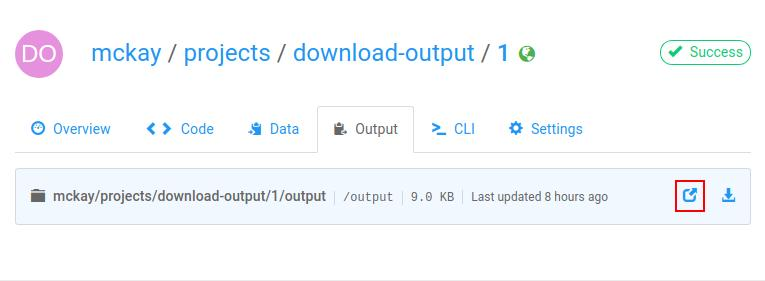

!!! important "Quick Look"
    On the job screen on floydhub.com:

    

    Or from the CLI:
    ```
    $ floyd output <username>/projects/<project_name>/<run_number>
    ```

After you've [saved output](data/storing_output) from a job, you can browse the
output of the job on `floydhub.com`.

To learn how to re-use output in a new job, see [this
documentation](reusing_output).

## From floydhub.com
From the job's page on floydhub.com, you can browse and download the output of
the job by using the "Browse" and "Download" icons found on the "Files" tab:


