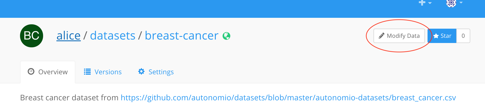

In this guide, we will explain how to modify an existing [FloydHub dataset](../create_and_upload_dataset.md).
First, browse until the dataset you want to modify from the web dashboard, then click on Modify Data button as showed in the  picture below.

This will open a [Workspace](../workspace.md) on a Standard CPU machine with the content of the dataset version you have choose to modify in the `/floyd/home/` directory. If you need to merge different datasets, you can [attach up to 5 different datasets to the Workspace](../workspace/#attaching-floydhub-datasets), then remember to copy and organize the content inside the `/floyd/home/` directory. You can also use the Jupyter Lab built-in data upload feature to upload up to 15MB of data.

!!! important "Jupyter Lab builtin upload"
    Unfortunately the built-in upload feature doesn't provide any feedback during the upload process. However, a fix for this feature is currently on our Roadmap.

Once you are done, stop the Workspace and all the content in the `/floyd/home` directory will become available as a new dataset version.

## Modify Data FAQS

Here a list of Frequetly Asked Questions about FloydHub Modify Data.

### Can I use a different type of machine/environment when modify data?

...

### Can I automatize this process from the CLI?

...

### I have accidentaly closed the Workspace related to a Modify Data session, and I'm not able to retrieve it from the web Dashboard, what can I do?

...
