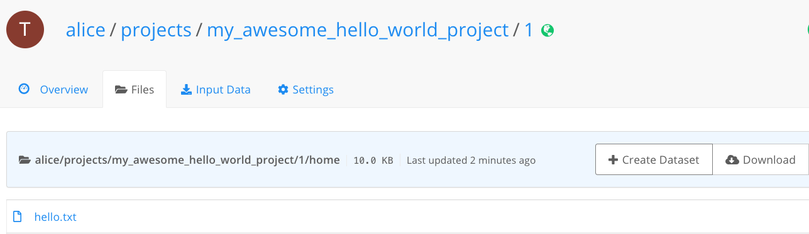
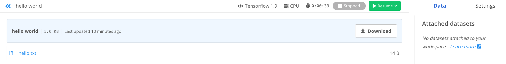
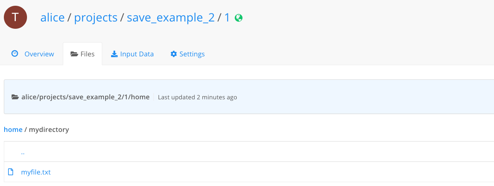

#### Overview
Saving information generated during a job is easy.

Every artefacts(file, folder, dataset etc...) your code will save in the current working directory (`/floyd/home`), it will be returned in the **Files** tab of your Job page or from the Workspace's **File Viewer** when the workspace is not in *Running* state.

Anything saved in this directory at the time a job or a Workspace finishes will be preserved
and can be accessed and reused later.

The most common thing users save is model checkpoints, but anything that ends up in the current working directory and its subfolders at the end of a job or a workspace session will be saved (use your imagination!).

Let's work through a couple of examples to see how to save data during a job.

#### Example 1
This job prints the string "Hello, world!", and saves it to a file called
`hello.txt`. Because `hello.txt` is located in the current working directory, it will
be saved and available after the job finishes:

```bash
$ floyd init my_awesome_hello_world_project
$ floyd run 'echo "Hello, world!" > hello.txt'
Creating project run. Total upload size: 691.0B
Syncing code ...
```

!!! note
    If you are not familiar with what
    `echo 'echo "Hello, world!" > hello.txt` does, here's a quick
    explanation:

    - The `echo "Hello, world!"` part outputs the string `Hello, world!`.
    - The `>` part of the command redirects the printed output of `echo "Hello, world!"`
      (which is, of course, `Hello world!`) to the file specified after the `>`.
    - The `hello.txt` part of the command specifies where the `Hello,
      world!` should be written to: `hello.txt`. Because `hello.txt` is
      created inside the current working directory, it will be preserved for future reference and
      use.

Here's the file in the **Files** tab:



If you want to try on Workspace, create and launch a new workspace, open the Terminal, run `echo "Hello, world!" > hello.txt` and stop the Workspace. Then you will be able to retrieve instanteniously the `hello.txt` file from the Workspace's **File Viewer** as showed in this picture:



#### Example 2
In this example, we'll use Python to save a file inside a folder in the current working directory
directory. Put this code in a file named `save_example.py`:

```python
import os

# Create the directory if not exists
if not os.path.exists('mydirectory'):
    os.makedirs('mydirectory')

# Create the file inside the directory
with open('mydirectory/myfile.txt', 'a') as f:
    f.write('Please save me!\n')
```

Then run the execution on FloydHub:

```bash
$ floyd init save_example_2
$ floyd run "python save_example.py"
Creating project run. Total upload size: 267.0B
Syncing code ...
```
Success! We can now view the output as before from the **Files** tab and navigate inside the newly created subfolder, download it, or even use it again in
future jobs.



Now that we've completed a couple trivial examples, let's do something more
useful and realistic.

#### Example 3
Here is a sample Tensorflow example that saves a model checkpoint. Because we
write (save) the data to the `models` directory (a folder inside the current working directory), we'll be able to use it later. A future job can use this model checkpoint as a starting point.
Consider this partial code, and note the call to `saver.save(sess,'/models/model.ckpt')`:

```python
import tensorflow as tf

...

saver = tf.train.Saver()
with tf.Session() as sess:
    sess.run(init)
    ...
    save_path = saver.save(sess, '/models/model.ckpt')
    print("Model saved in file: %s" % save_path)
    ...
```

Because model is stored in a folder inside the current working directory, it will be saved
even after your job or workspace session ends, and can be used again in future jobs or when the workspace is restarted.

#### Using Files as a data source

You can use the Files of one job as the input to your next job. To see how to
mount Files data, please see [this guide](./mounting_data#mounting-the-output-of-another-job)

{!contributing.md!}
