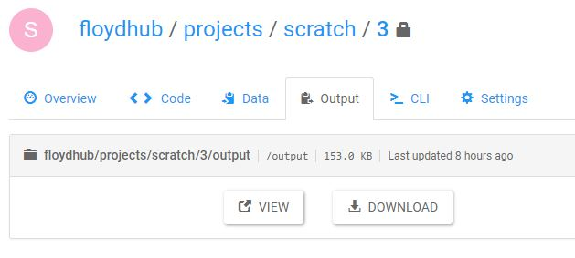

Most jobs generate output files (eg. model checkpoints, logs, evaluation output). In Floyd, `/output` is a special directory used to store outputs. 

Any file or directory you create at runtime under the `/output` directory will be retained and available to you for download after your job finishes.

#### Example 1

This job runs a Python script called `helloworld.py` and redirects its output logs into the file `/output/my-output-file.txt`:

```bash
$ floyd init quick-start
$ floyd run "python helloworld.py > /output/my-output-file.txt"
Syncing code ...
...
```

*NOTE*: This is a simple example that only stores the standard output of `helloworld.py`. Since the file is created under the special `/output` directory, it will be saved even after your job has ended. 


#### Example 2

If you want to save and retain your model checkpoints and other data inside your code, you should write them to `/output`.

Here is a sample Tensorflow example that saves the model weights:

`save_restore_model.py`
```bash
import tensorflow as tf

...

saver = tf.train.Saver()
with tf.Session() as sess:
    sess.run(init)
    ...
    save_path = saver.save(sess, '/output/model.ckpt')
    print("Model saved in file: %s" % save_path)
    ...
```

Again, since the model is stored under the special `/output` directory, they will be saved even after your job ends. 

You can view or refer to this output using the [floyd output](../../commands/output) command

```bash
$ floyd output floydhub/projects/quick-start/1/output
Opening output directory in your browser...
```

Alternatively, you can visit the `Output` tab of the job on your dashboard




## Using output as a data source

You can use the output of one job as the input to your next job. To see how to mount output data, please see [this guide](./mounting_data#mounting-the-output-of-another-job)

{!contributing.md!}
