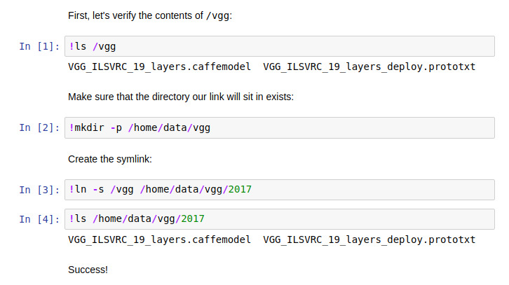

Floydhub's basic data-mounting functionality is sufficient for most users'
needs. However, if you find yourself with more complex requirements, symlinking
can almost certainly provide a solution.

Here are some common FloydHub data-mounting needs that symlinking can solve:

  - Code requires the data to be available at a location that is not valid with
    the mounting syntax of `floyd run --data`.
  - Multiple mounted datasources need to be available under a single directory.
  - Directories in a single datasource need to be split into their own
    locations.

Simply copying the data from one location to another during your job would also
solve these problems, but copying data is slow and inefficient, especially for
large datasets. Symlinks can be created very quickly and are a much more ideal
solution.

## Creating symlinks
You can create symlinks on FloydHub's deep-learning servers during your job
using the same `ln` command available on \*nix operating systems (like Linux
and MacOS). To create a symlink during a job you'll need to send the `ln`
command to the server's operating system. If you already know how to create
symlinks on a \*nix OS, you can skip forward to the [Ways to use the `ln`
command with FloydHub section](#ways-to-use-the-ln-command-with-floydhub). If
you don't know much about symlinks, read on for a quick primer.

### Intro to symlinks
You can think of a symlink as an alias for a file or directory that allows
programs to find the file or directory at more than one location on the file
system. Calling a symlink an "alias" isn't a technically correct way to refer
to it, but we'll sometimes use that term in this guide because it can be more
fitting and easier to internalize and remember.

#### Symlink (`ln`) syntax
Creating a symlink on a \*nix OS uses the `ln` command. Here is the syntax:
```
$ ln -s <TARGET> <LINK_PATH_WITH_OPTIONAL_NAME>
```

Where `<TARGET>` is the path of the existing file or directory you want to
create an alias/symlink for, and `<LINK_PATH_WITH_OPTIONAL_NAME>` is the path
and (optional) name of the new symlink/alias of the `<TARGET>`.

If `<LINK_PATH_WITH_OPTIONAL_NAME>` doesn't include a name, the name of the
`<TARGET>` will be used. Let's go through a couple of examples to clarify that.
Assuming you want to create an alias/symlink for `/my_data` and have already
created a new directory called `/existing_dir`:

  - Specifying a name in `<LINK_PATH_WITH_OPTIONAL_NAME>`:
    ```
    $ ln -s /my_data /existing_dir/new_name_for_my_data`
    ```
    The new name here is `new_name_for_my_data`. Given the command above, your
    data will be accessible at `/my_data` and
    `/existing_dir/new_name_for_my_data`.
  - Without specifying a name in `<LINK_PATH_WITH_OPTIONAL_NAME>`:
    ```
    $ ln -s /my_data /existing_dir`
    ```
    Because no new name was given, the name of the `<TARGET>` (which is
    `my_data`) will be used. The data will accessible at `/my_data` and
    `/existing_dir/my_data`.

Here are some notes/gotchas about creating symlinks using `ln`:

  - Always use absolute paths for both the `<TARGET>` and
    `<LINK_PATH_WITH_OPTIONAL_NAME>` parameters. This will ensure you don't run
    into some odd behaviors that can manifest when using relative paths.
  - The directory in which the `<LINK_PATH_WITH_OPTIONAL_NAME>` terminates must
    already exist. For example, if you want to make the data located at
    `/my_data` to be aliased/symlinked at `/home/me/foo_data`, you first need
    to create the `/home/me` directory.The following commands would
    successfully implement this goal:
    ```
    # First we make sure the /home/me directory exists:
    $ mkdir -p /home/me

    # Now we are ready to create the symlink. We'll supply the name foo_data
    # to the <LINK_PATH_WITH_OPTIONAL_NAME> parameter:
    $ ln -s /my_data /home/me/foo_data
    ```

### Ways to use the `ln` command with FloydHub

To send the `ln` command to the server's OS to create a symlink during your
job, you can follow one of at least a few approaches:

#### 1. Using the `[COMMAND]` portion of `floyd run`

With this approach, we add the `ln` calls to the `[COMMAND]` portion of the
call to `floyd run [OPTIONS] [COMMAND]` (see the `floyd run` syntax
[here](../../commands/run.md)). This is the most straight-forward approach, but
it can it can get a bit unwieldy if you have more complex needs.

##### Example 1

Let's say you have two datasources mounted under `/train` and `/test`,
respectively. Your Python script `train_and_eval.py` expects both the
datasources to be available under the same parent directory, say `/data/train`
and `/data/test`. You can symlink the datasources to those locations.

In the example below, we create a directory called `/data`, and then create
links inside of it to our datasets, which are at `/train` and `/test` (note the
`--data` flags). This means that our Python script can reference `/data/train`
and `/data/test` and it will find our datasets.

The `[COMMAND]` portion of the `floyd run [OPTIONS] [COMMAND]` in this example
chains a series of commands, which are executed in sequence:

1. `mkdir -p /data`
2. `ln -s /train /data`
3. `ln -s /test /data`
4. `python train_and_eval.py`

Here's the command in full:

```bash
$ floyd run \
  --data udacity/datasets/bike-sharing-dataset/1:train \
  --data floydhub/datasets/mnist-test/1:test \
  "mkdir -p /data && ln -s /train /data && ln -s /test /data && python train_and_eval.py"
```

#### 2. Using a bash script

As you can see in the previous section, using the `[COMMAND]` portion of `floyd
run [OPTIONS] [COMMAND]` can get unwieldy when there are many commands. A
better alternative is to create a bash script that creates our symlinks and
also kicks off our main Python script.

If you are not familiar with writing bash scripts, a quick search of the
Internet can get you up to speed on the basics, but bash scripting is out of
the scope of this documentation.

##### Example 1

This bash script should live in the root/top-level directory of your project.
We'll call ours `run.sh`. Here's an example of what it might look like:

```bash
#!/bin/bash

# Create a /data directory
mkdir /data

# Symlink mounted data to their destinations
ln -s /train /data
ln -s /test /data

# Execute Python script
python train_and_eval.py
```

Let's execute the bash script using `floyd run`:

```bash
$ floyd run \
  --data floydhub/datasets/imagenet-vgg-verydeep-19/1:train \
  --data floydhub/datasets/mnist/1:test \
   "bash run.sh"
```

Because the last line of our bash script runs our Python script, we can kick
off our entire job by running only the bash script.

This is a very effective pattern if your jobs require a more complex
setup—create a bash script that sets up your environment, and then have the
bash script call your python script. This keeps your setup separate from your
code, and keeps things clean.

##### Example 2

Your data is mounted under `/vgg` using `--data
floydhub/datasets/vgg-ilsvrc-19-layers/1:vgg`. However, your code expects the
data to be present at `/home/data/vgg/2017`. Let's create a symlink to make
your data available at `/home/data/vgg/2017`. Here's an example of a bash
script (we'll call it `run.sh`) that takes care of the symlinking and
calls our training script.

```bash
#!/bin/bash

# Create directory
mkdir -p /home/data/vgg

# Symlink our data at /home/data/vgg/2017
ln -s /vgg /home/data/vgg/2017

# Call our training script
python train.py
```

Now let's tie it all together with our `floyd run command`:

```
$ floyd run --data floydhub/datasets/vgg-ilsvrc-19-layers/1:vgg "bash run.sh"
```

#### 3. For Jupyter Notebooks
Symlinking with Jupyter Notebooks follows the same principles that a regular
job does. Here's an example:

##### Example 1
Your data is mounted under `/vgg` using `--data
floydhub/datasets/vgg-ilsvrc-19-layers/1:vgg`, but you want your data to be
present at `/home/data/vgg/2017`. The notebook below accomplishes that with a
symlink:


{!contributing.md!}

