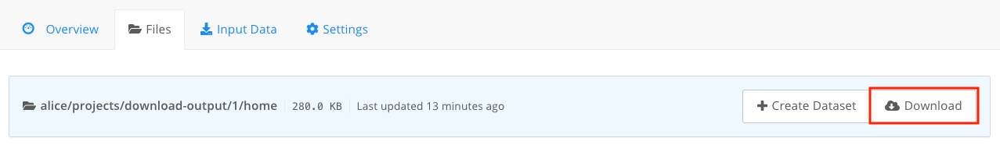
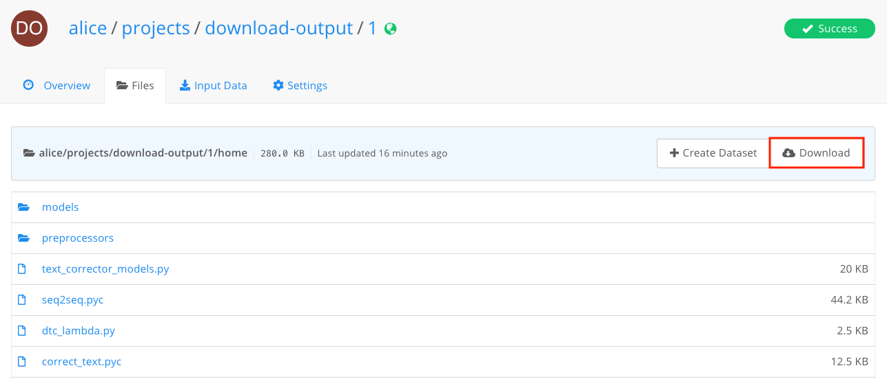
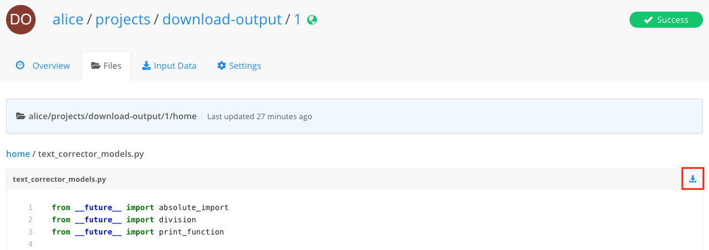

!!! important "Quick Look"
    On the job screen on floydhub.com:

    

    Or from the CLI:
    ```
    $ floyd clone <username>/<project_name>/<run_number>/
    ```

After you've [saved output](data/storing_output) from a job, you can download
the output of the job on `floydhub.com` or from the CLI.

To learn how to re-use output in a new job, see
[this documentation](reusing_output).

## From floydhub.com
From the job's page on floydhub.com, you can browse and download the output of
the job by using the "Browse" and "Download" icons found on the "Files" tab:



Or you can download single files by browsing until the file you want to download and click on the download icon at the top-right of the opened file tab.



## From the CLI
To open the browsing window from the CLI, use the
[`floyd data clone`](../commands/data) command and pass it the path of the
job's output:

```
$ floyd clone alice/projects/download-output/1/
Opening output directory in your browser ...
```

The path of the output is `<your_username>/projects/<project_name>/<run_number>/`.

