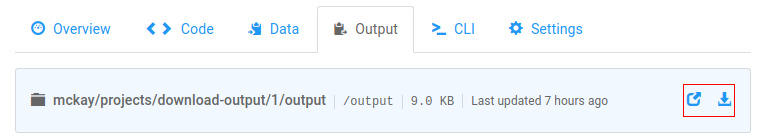
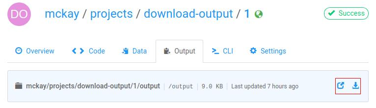

!!! important "Quick Look"
    On the job screen on floydhub.com:

    

    Or from the CLI:
    ```
    $ floyd output username/project_name/run_number
    ```

After you've [saved output](data/storing_output) from a job, you can browse and
download the output of the job on floydhub.com.

## From floydhub.com
From the job's page on floydhub.com, you can browse and download the output of
the job by using the "Browse" and "Download" icons found on the "Output" tab:



## From the CLI
To open the browsing window from the CLI, use the [`floyd
output`](../commands/output) command:

```
$ floyd output mckay/projects/my_proj/1
Opening output directory in your browser ...
```

