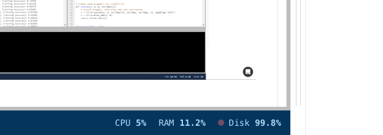

# Insights

Insights offer warning alerts about the condition of your FloydHub machine during an active Workspace session. Specifically, Insights are connected to the available System Metrics for your Workspace. For more information on System Metrics, please visit the [System Metrics](https://docs.floydhub.com/guides/jobs/metrics/#system-metrics) docs page.

Insights will be found in the bottom bar of your Workspace, indicated by a circle icon next to the name of the System Metric. Click on the Metric to open a chart of its values, along with a message about the Insight.

### Levels

There are three levels of Insight (in ascending levels of severity):

| Level | Visual | How to proceed |
|------|-------|------------------|
| Info |  | You are seeing out of ordinary behavior with this metric. You should take a look to make sure this is expected |
| Warning  |  | The metric is continuing to behave unusually. Investigate to avoid training failure or wasted resources. |
| Alert  |  | You action is required immediately. In unattended, this could lead to failure of your training instance or wasted resources. |

!!! important "Beta feature"
    Insights is currently in beta and under active development. If you have feedback or feature requests, please let us know - via the chat bubble or email [support@floydhub.com](mailto:support@floydhub.com)

### GPU Utilization

Insights for GPU Utilization indicate that you're under-utilizing your GPU during your Workspace session. As a result, you might want to optimize your training code to better utilize your GPU.

Alternatively, if you're still in active development of your code, you might want to run your workspace in CPU mode, and then only switch back to GPU when you're ready for the additional compute power during training.

When you see this Insight, you can try the following approaches to better utilize the GPU:

- Increase the batch size
- Make your model deeper
- Make sure there are no bottlenecks in your input data pipeline

Also, for some tasks, it is many not be possible to fully utilize the GPU capacity due to the nature of the model you are building. For example, if your training requires resource intensive pre / post-processing on CPU - your GPU may not be fully utilized.

#### Insights

| Type | Reason|
|------|-------|
| Info | GPU Utilization has been under 70% of capacity for the last five (5) minutes |
| Warning  | GPU Utilization has been under 70% of capacity for the last fifteen (15) minutes |
| Alert  | GPU Utilization has been under 80% of capacity for the last thirty (30) minutes |

#### Why is my GPU usage at 0%?

Verify that your framework supports GPU acceleration. Tensorflow [automatically enables GPU](https://www.tensorflow.org/programmers_guide/using_gpu) and uses it for your training. 
For PyTorch you need to [enable cuda](https://pytorch.org/docs/master/notes/cuda.html). For other frameworks, please consult the framework docs for this.

Note: All the operations can be placed on the GPU. Some frameworks provide an API for the device placement of specific operations and variables - this can be a really useful tool for debugging this issue. Please consult the framework docs for this.

!!! warning "Metrics frequency"
	The system metrics on FloydHub are collected every 60 seconds. If your computation is not consistently high it will fall within the sampling frequency and you may not see the change in system metrics.
    For example: training a shallow network on the MNIST data will finish within a few seconds.

!!! important "Real-time monitoring"
	For a more fine grained monitoring of the machine resources we recommend running these commands from a terminal: `top` and `nvidia-smi -l 2`

### RAM (Memory) Utilization

Insights for RAM Utilization will indicate when your FloydHub machine's RAM is getting close to its maximum, which could lead to Out-of-Memory Errors.

When you see this Insight, you should try to:

- Reduce the number of samples you are loading in memory - consider using a subset of your data
- Switch to an machine with more RAM (If you are using CPU, consider CPU2)

This Insight will consistently track the latest reported value of your machine's RAM.

#### Insights

| Type | Reason|
|------|-------|
| Info | RAM Utilization is currently greater than 75% |
| Warning  | RAM Utilization is currently greater than 90% |
| Alert  | RAM Utilization is currently greater than 95% |

### Disk Utilization

Insights for Disk Utilization will indicate when your FloydHub machine is running low on disk space. Each FloydHub machine comes with 100GB of disk space and you will not be able to save any files after you hit this limit.

If you are seeing this Insight, it could indicate that you've saved large amounts of files that should be deleted.

!!! important "Checkpointing Strategy"
	If you are checkpointing very frequently that can lead to a high usage of disk space. For alternative checkpointing strategies, see our [Checkpoint Strategy](https://blog.floydhub.com/checkpointing-tutorial-for-tensorflow-keras-and-pytorch/) blog post.

This insight will consistently track the latest reported value of your machine's disk space.

#### Insights

| Type | Reason|
|------|-------|
| Info | Disk Utilization is currently greater than 75% |
| Warning  | Disk Utilization is currently greater than 90% |
| Alert  | Disk Utilization is currently greater than 95% |
