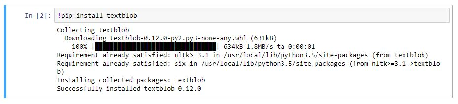
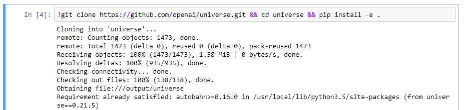

Floydhub's [environments](../environments.md) come with many common deep learning and machine learning packages and dependencies preinstalled. Examples of pre-installed packages include `numpy`, `scipy`, [OpenCV](http://opencv.org/), [OpenAI Gym](https://gym.openai.com/), [SpaCy](https://spacy.io/), etc.

If you need additional or custom packages, you can install them before running your job.

## Installing Python dependencies

If your code needs additional Python packages at run time, you can add them to
a special file named `floyd_requirements.txt`. If you want to install
non-Python packages, please see [here](#installing-non-python-dependencies).

It is similar to Python's [requirements.txt](https://pip.pypa.io/en/stable/user_guide/#requirements-files) file and should be present in the same directory from where you issue the `floyd run` command. This is a special file that will be read before your job is started and the packages listed here will be installed before running your job.


Here is an `floyd_requirements.txt` example file:

```bash
redis
tqdm==4.11.2
```

When this file is present in the project's root directory, any job that is run inside this project will have the `redis` and `tqdm` (version `4.11.2`) packages installed and available at runtime.

#### Notes

- **Only Python packages**: This will only install Python packages available in [PyPi](https://pypi.python.org/pypi). Please ensure that the package you are trying to install is available.
- **One package per line**: Ensure that you have only one package per line in `floyd_requirements.txt`
- **Installing specific versions**: You can install specific versions of packages using the `<package>==<version>` notation. For example, an entry `tqdm` will install the latest version of the package, but `tqdm==4.11.2` will force install that specific version.

## Installing Non-Python Dependencies

You might want to install non-Python packages or other packages that have custom installation steps. If you are using a Jupyter Notebook, you can follow [these steps](#installing-dependencies-inside-jupyter-notebook) to install arbitrary packages interactively.

If you are running a script using the `floyd run "<command>"` command, you can do one of the following:

1. **Include the installation steps in the `<command>`**

    For example, to install [OpenAI Universe](https://github.com/openai/universe)
    before running your actual script `train.py`:

    ```bash
    $ floyd run "git clone https://github.com/openai/universe.git && cd universe && pip install -e . && python train.py"
    ```

    This will clone the Universe git repo, install it and then execute `python
    train.py`.

2. **Create an installation script**:

    Including the setup instructions in the `run` command can get unwieldy very
    soon. An alternative would be to create a bash script with the sequence of
    setup commands (say, `setup.sh`) and then execute this bash script as part
    of your `floyd run`.

    Here's an example of what `setup.sh` might look like:

    ```
    #!/bin/bash

    git clone https://github.com/openai/universe.git
    cd universe
    pip install -e .
    ```

    Execute the setup bash script in your `floyd run` command before your
    actual job:

    ```bash
    $ floyd run "bash setup.sh && python train.py"
    ```

!!! note

    Your job will run in a Linux environment. You can use the APT package
    manager to install dependencies using `apt-get`.

## Installing Dependencies Inside Jupyter Notebook

You can install packages (Python or otherwise) interactively inside Jupyter Notebooks. To execute a non-Python command inside a Notebook, prepend it with `!`.

For example, to install `textblob`, you can execute `!pip install textblob` inside your Notebook:



You can also use this method to install non-Python packages. For example, to install [OpenAI Universe](https://github.com/openai/universe) inside your Notebook, you can execute `!git clone https://github.com/openai/universe.git && cd universe && pip install -e .`



{!contributing.md!}
