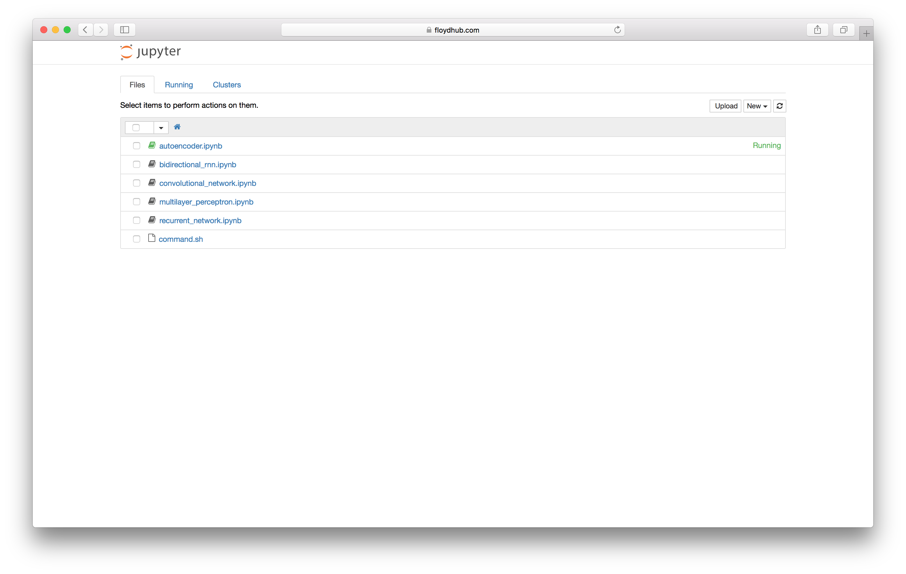

# Jupyter Notebook

[Jupyter](http://jupyter.org/) or [IPython](https://ipython.org/) Notebooks allow you 
to create and share documents that contain live code, equations, visualizations and explanatory text. It is 
great for interactive development of code. This guide will show you how to run a Jupyter notebook on Floyd.

### Setup project

Clone a project which contain deep learning jupyter notebooks. See some great 
Tensorflow Notebook examples at [floydhub/tensorflow-notebooks-examples](https://github.com/floydhub/tensorflow-notebooks-examples).
Then initialize a floyd project inside that.

```bash
$ git clone https://github.com/floydhub/tensorflow-notebooks-examples.git
$ cd tensorflow-notebooks-examples/3_NeuralNetworks
$ floyd init neural-networks
```

### Run in Jupyter mode

Floyd [run](../commands/run.md) command has a `jupyter` mode. This will upload the jupyter notebooks in the current 
directory and start a jupyter server for you.

```bash
$ floyd run --mode jupyter
Syncing code ...
RUN ID                  NAME                          VERSION
----------------------  --------------------------  ---------
dMoDZaCcvQMyfNbgwTx9f8  floydhub/neural-networks:1          1

Path to jupyter notebook: https://www.floydhub.com:8000/EQDsTpeqB3RkjpHUgBGDyB

To view logs enter:
    floyd logs dMoDZaCcvQMyfNbgwTx9f8
```

You can open the link to your jupyter server (example `https://www.floydhub.com:8000/EQDsTpeqB3RkjpHUgBGDyB`). 
All the notebooks in your project should be available for you to run.



### Selecting the environment

Jupyter notebooks run in the same environments as other jobs. You can select any environment you want 
along with the `--env` parameter of the [run](../commands/run.md) command. You can see the list of supported environments
[here](../home/environments.md).

```bash
$ floyd run --mode jupyter --env tensorflow:py2
Syncing code ...
```

To use Jupyter Notebook in a GPU instance, use the `--gpu` flag with the `run` command.
### Additional dependencies

If you have any additional python dependencies, you can also add a `floyd_requirements.txt` file to 
the notebook directory before floyd run. The packages specified there will be installed before running the 
jupyter server

### Passing Input data and storing Output data

Similar to regular jobs, any data passed during `floyd run` using the `--data` flag will be mounted 
at `/input` (see [Using Datasets](/home/using_datasets/)). Any data that you write to `/output` will be stored for you, even after you end your 
interactive Jupyter session (see [Managing Output](/home/managing_output)).

### Saving Jupyter Notebooks

Jupyter notebooks are saved as run outputs. You can view and download them after the Jupyter instance is 
stopped. You can use the [output](../commands/output.md) command for this.

### Stopping Jupyter Server

Once you have experimented with your code, you need to manually stop your "job". Run the [stop](../commands/stop.md) command 
for this. Remember Jupyter notebooks are charged for the entire duration they are up, not just when you
execute code. So make sure the stop the notebooks when you are no longer working on them.

{!contributing.md!}
