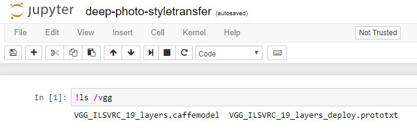
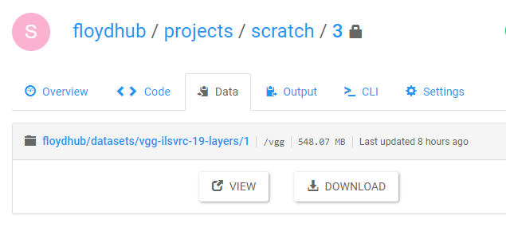

In this guide, we will explain how to attach a dataset to your project run.

### Quick Preparation Checklist

- You must have a [FloydHub account](https://www.floydhub.com/signup)
- You must be [logged in to your web dashboard](https://www.floydhub.com/login)
- You must have `floyd-cli` [installed on your computer](basics/install.md)

You can use the [floyd login](../commands/login.md) command to login to your FloydHub account through your command line

## Datasets

Floyd datasets are directories of data files that can be used in a project run. To create a new dataset, please follow 
[this guide](./basics/create_new/#create-a-new-dataset). You can view the datasets you 
have created in the [datasets page](https://www.floydhub.com/datasets) in the dashboard. You can also view 
public datasets by searching for it on FloydHub.

## Mounting datasets

### Overview

You can mount one or more datasets when you run a job using the [floyd run](../commands/run) command. This automatically makes 
the mounted datasets available for you to use in your job, without having to download them each time.

To mount a specific version of a dataset, you need to specify its full name and the mount point. 
The syntax is `--data <data_name>:<mount_point>`

For example, to mount the [VGG 19-layers](https://www.floydhub.com/floydhub/datasets/vgg-ilsvrc-19-layers/1) dataset under `/vgg`:
```bash
floyd run --data floydhub/datasets/vgg-ilsvrc-19-layers/1:vgg --mode jupyter
```

This will spin up a Jupyter Notebook, inside which you will have access to the VGGNet pre-trained models under `/vgg`.



*Note*: You can use the `--data` flag with `floyd run` when you are running a command too.

```bash
$ floyd run --data floydhub/datasets/vgg-ilsvrc-19-layers/1:vgg "python train.py"
```


### Mounting the output of another job

In FloydHub, you can link jobs by mounting the output of one job as the input of a new job that you are going to run. This allows you to derive from an existing job or restart a stopped or timedout job.

You can refer to the output of a job by its name with `/output` appended to it.

For example: `floydhub/projects/handwriting-recognition/12/output` refers to the output of the job `floydhub/projects/handwriting-recognition/12`

You can mount this using the `--data` flag in the `floyd run` command, similar to datasets. For example:

```bash
$ floyd run --data floydhub/projects/handwriting-recognition/12:filtered_training_data "python train.py"
```

This will make the output of `floydhub/projects/handwriting-recognition/12` available at `/filtered_training_data` for the new job to use.

*Note*: You need to have access to the job to be able to mount it's output.


### Mounting multiple datasources

You can attach upto 5 datasources when you run a job using the `--data` flag in the [floyd run](../commands/run) command. This includes both datasets and job outputs. Ensure that the mount points for the datasets are unique.

```bash
$ floyd run --data floydhub/datasets/mnist/2:training --data floydhub/datasets/digits/1:test "python script.py"
```
In this case, the above datasets will be mounted at `/training` and `/test` respectively.


### Web dashboard

You can view the mounted datasets and their respective mount points for a specific job by going to the `Data` tab:




### Details

#### Datasource name

The full name of a datasource (`<username>/datasets/<dataset_name>/<version>`) consists of 3 parts: 

- Username
- Dataset Name
- Version

For example: `floydhub/datasets/mnist/2`

#### Mount point

The mount point is an absolute path. For example, `--data floydhub/datasets/vgg-ilsvrc-19-layers/1:vgg` will mount the data at `/vgg`.

A common mistake is to look for the mounted data in the current directory (`./vgg`), rather than using the absolute path (`/vgg`)

#### Default mount points

We highly recommend that you explicitly specify the mount points for your data using the `--data <data_name>:<mount_point>` convention.

If, however, you do not specify a mount point, the default values are:

- Single data mount: If you only mount one datasource without specifying a mount point, it is mounted at `/input`

- Multiple data mounts: If you mount multiple datasource without specifying mount points, they will each be mounted under their respective GUIDs (e.g. `/xKduBzTr4LAsc6eVPZVPVd`). GUIDs are 32-character random strings that difficult to track down, so we highly discourage this pattern.

