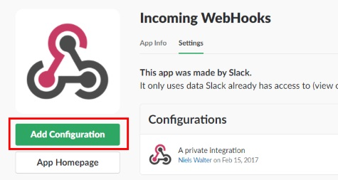
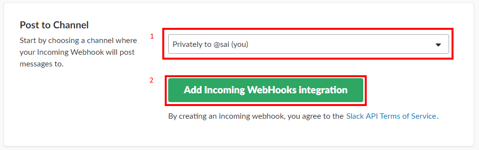
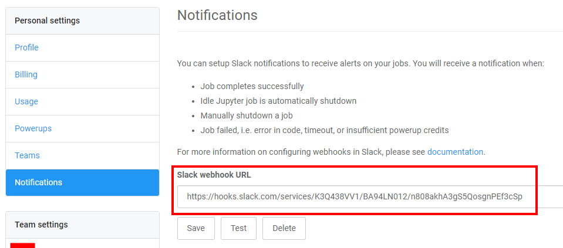
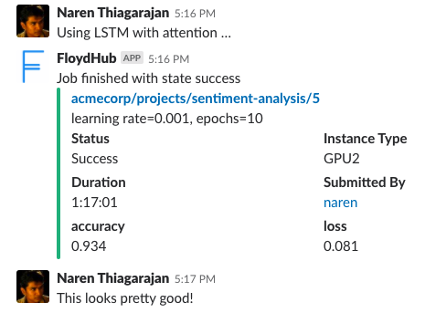

You can setup Slack notifications to receive alerts on your FloydHub jobs.  You will receive a notification when:

* Job completes successfully
* Idle Jupyter job is shutdown automatically
* Job is manually shutdown
* Job failed, i.e. error in code, timeout, or insufficient powerup credits

## Steps to create an incoming webhook in your Slack

1. Create an incoming webhook in your Slack app [here](https://slack.com/apps/A0F7XDUAZ-incoming-webhooks).
1. Click **Add Configuration**.

1. Select the channel that you want to post the notifications. Click **Add Incoming Webhooks integration**.

1. Scroll down to **Integration Settings**. Copy the **Webhook URL** (don't worry about the other settings, we'll handle it).

1. Make sure to click on **Save Settings**.
1. In Floydhub, go to [Notifications settings](https://www.floydhub.com/settings/notifications), paste in the Slack webhook url, and click **Save**.

1. Click **Test** to receive your first Slack notification! Going forward, you should receive notifications for all jobs you run on FloydHub.

For more information on configuring webhooks in Slack, please see Slack's
[help page](https://get.slack.help/hc/en-us/articles/115005265063-Incoming-WebHooks-for-Slack).
