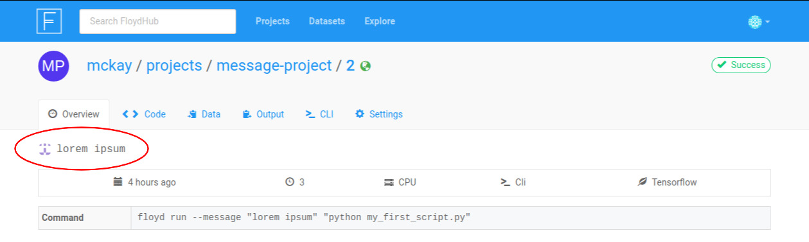
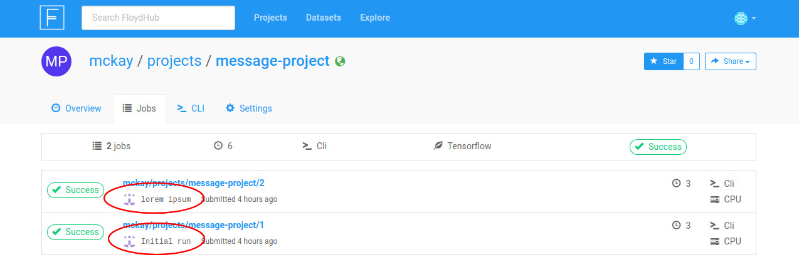

!!! important "Quick Look"
    `floyd run [OPTIONS] [COMMAND]`

    **[[OPTIONS]](#options_1):**

    - [Instance Type](#instance-type): `--cpu` **or** `--gpu` **or** `--cpu+` **or** `--gpu+`
    - [Dataset(s)](#datasets): `--data <name_of_datasource>:<mount_point_on_server>`
    - [Mode](#mode): `--mode <mode_name>`
    - [Environment](#environment): `--env <environment_name>`
    - [Message](#message) `--message` **or** `-m`
    - [Tensorboard](#tensorboard): `--tensorboard`

    **[[COMMAND]](#command_1)**

Running jobs is the core action in the FloydHub workflow. A job pulls together
your code and dataset(s), sends them to a deep-learning server configured with
the right environment, and actually kicks off the necessary code to get the
data science done. This article serves as a more in-depth look at the
ins-and-outs of running jobs on FloydHub using the `floyd run` command.

The `floyd run` command can be broken down into the two main parts: the
`[OPTIONS]`, and the `[COMMAND]`. We'll detail all the `[OPTIONS]` available to
you, as well as how to use the `[COMMAND]` properly. Use the links below as a
quick reference.

## Parts of the `floyd run` Command

### [[OPTIONS]](#options_1)
- [Instance Type](#instance-type): `--cpu` **or** `--gpu` **or** `--cpu+` **or** `--gpu+`
- [Dataset(s)](#datasets): `--data`
- [Mode](#mode): `--mode`
- [Environment](#environment): `--env`
- [Message](#message) `--message` **or** `-m`
- [Tensorboard](#tensorboard): `--tensorboard`

### [[COMMAND]](#command_1)

## [OPTIONS]
### Instance Type

To specify the instance type means to choose what kind of FloydHub instance
your job will run on. Think of this as a hardware choice rather than a software
one. (The software environment is declared with the
[Environment (`--env`)](#environment) `OPTION` of `floyd run` command.)

You have four instance type options to choose from when running a job as
detailed below:

|`floyd run` Flag|Instance Type|Description           |
|:------------|:--------------:|:---------------------|
|`--gpu`      |GPU             |Preemptible GPU server|
|`--gpu+`     |GPU             |Dedicated GPU server  |
|`--cpu`      |CPU             |Preemptible CPU server|
|`--cpu+`     |CPU             |Dedicated CPU server  |

!!! important

    - The default instance flag is `--cpu`. This means that if you don't pass
      any of the above flags to `floyd run`, your job will be run on a
      preemptible CPU server.
    - If you pass more than one instance flag, this is the order of precedence:
      `--gpu+`, `--cpu+`, `--gpu`, `--cpu`

#### What is the difference between a preemptible and a dedicated instance?

Refer to [this section](../faqs/plans/#preemptible-vs-dedicated-instances) of
the documentation for more information about dedicated and preemptible
instances.


### Dataset(s)

You can specify up to five datasources (datasets or outputs from previous jobs)
to mount to the server that will be running your job. For each datasource,
specify the `--data` flag as detailed below:

```
--data <name_of_datasource>:<mount_point_on_server>
```

For more detailed information on mounting data to jobs, see
[this article](../guides/data/mounting_data)

### Mode

FloydHub jobs can currently be run in one of three modes:

1. `--mode job` (DEFAULT)
2. `--mode jupyter`
3. `--mode serve`

Here is a description of each mode:

#### `--mode job`

This is the default mode so there is no need to specify `--mode job` when
running `floyd run`. You can think of this mode as "regular mode" or "command
mode". When you run your job in this mode, your code is sent up to a FloydHub
deep-learning server and the [[COMMAND]](#command) portion of `floyd run`
is executed.

#### `--mode jupyter`

This is Jupyter Notebook mode. When you specify `--mode jupyter`, your code is
uploaded to a FloydHub deep-learning server, and a Jupyter Notebook session is
started in the directory containing your code.

FloyHub serves this Jupyter Notebook session for you. Your Jupyter Notebook
session will be automatically opened in a web browser when it becomes
available. If you don't want your browser to automatcially open, pass the `--no-open` flag to `floyd run`.

!!! important "Use This Mode When:"
    1. You want to work with a **Jupyter Notebook**.
    2. You want to open an **interactive shell** on the FloydHub server where your code
       is running. For details on how to do that, see [this article](../guides/ssh)

#### `--mode serve`

This mode is for serving your deep learning models as an API endpoint. To use
serve mode, you'll need to make sure your project's code meets a few
requirements:

- Contains a file called `app.py` that contains a Flask application that will
  listen on port 5000.
- Contains a `requirements.txt` file that contains the line `flask`, which
  declares it as a dependency.

!!! warning
    This mode is currently in preview, and is not appropriate for production
    use.

### Environment

Specifying the environment means choosing what major deep-learning software
packages you want available on the server that runs your code. This is not a
specification between a CPU server and a GPU server (that's the
[Instance Type](#instance-type) `OPTION` of `floyd run`).

FloydHub offers servers with many different deep-learning software packages
pre-installed.  You can find a list of all the available environments
[here](../guides/environments).

Use the `--env` flag to specify which environment you would like your job to
run in.

!!! important

    It is best practice to pass the entire name of the environment,
    including the version number, to the `--env` flag. For example, instead of
    `--env tensorflow`, use `--env tensorflow-1.3`.

!!! note "Examples"

    ```
    $ floyd run --env tensorflow-1.3 "python train.py"
    ```

    ```
    $ floyd run --env theano-0.8 "python train.py"
    ```

    ```
    $ floyd run --env pytorch-0.2 "python train.py"
    ```

### Message

Using `--message` or `-m`, you can specify a message that describes your job,
similiar to the way a commit message describes a git commit. The job message
will be displayed at various places on floydhub.com and is useful when
reviewing past jobs that you'd like to iterate on.

Example:

```
$ floyd run -m "lorem ipsum" "python my_first_script.py"
Creating project run. Total upload size: 195.0B
Syncing code ...
[================================] 1254/1254 - 00:00:00

JOB NAME
--------------------------------
mckay/projects/message-project/1

To view logs enter:
   floyd logs mckay/projects/message-project/1
```

Here are some examples of where the job message will be displayed on floydhub.com:




### Tensorboard

The `--tensorboard` flag allows you to enable Tensorboard on your job. For more details, see [this article](../guides/jobs/tensorboard).

## [COMMAND]

The `[COMMAND]` portion of `floyd run` is the command that will be executed on
the server when your job begins. It will be run in the directory on the server
that holds your code. To decide what to put in the `[COMMAND]`, answer this
question:

> What command would I execute to kick off my code locally?

The answer to that question is what you should put into the `[COMMAND]` portion
of `floyd run`.

Any valid `bash` command will work in the `[COMMAND]` portion of `floyd run`.
For example, try these simple examples and look at their logs:

```
$ floyd run "pwd"
```

```
$ floyd run "ls"
```

```
$ floyd run "python -v"
```

```
$ floyd run "echo 'Hello, world!'"
```

Most commonly you'll be kicking off a Python script with your `[COMMAND]`, with
something like this:

```
$ floyd run "python train.py"
```

But you can feel free to get creative!

!!! important "Pro Tip"

    Try chaining together multiple commands with `&&` like this:

    ```
    $ floyd run "bash my_setup_script.sh && python train.py"
    ```

    For more examples, check out our
    [symlinking tutorial](../guides/data/symlink_mounted_data/#1-using-the-command-portion-of-floyd-run).

!!! note

    Jupyter Note book mode (`--mode jupyter`) and serve mode (`--mode serve`)
    do not take a `[COMMAND]`. You'll kick off your job without passing a
    `[COMMAND],` with something like the following:

    ```
    $ floyd run --env pytorch-0.2 --mode jupyter
    ```

    ```
    $ floyd run --env pytorch-0.2 --mode serve --data a/datasets/b/1:mount
    ```

{!contributing.md!}
