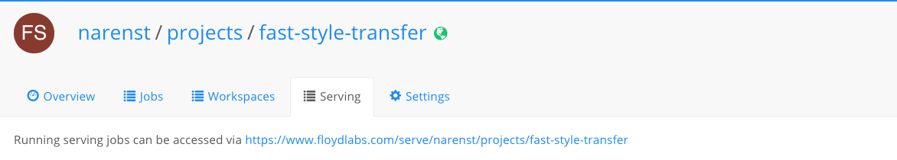

You can use FloydHub to deploy your trained models as REST APIs with a single command: `floyd run --mode serve`.

The `floyd run` command has a serve mode. Executing `floyd run --mode serve` from your terminal starts a web server on FloydHub and returns a REST endpoint that you can query.

In order to serve your model, you need to provide an `app.py` file. Inside this file, you need to create a WSGI application object using your favorite Python web framework and assign it to a global variable named `app`. For example, here is how to create a WSGI application object in Flask:

```python
from flask import Flask
app = Flask(__name__)
```

Below is a minimal Flask boilerplate that you can modify and get something working quickly:

```python
from flask import Flask, jsonify, request

app = Flask(__name__)


def load_model():
    """Load and return the model"""
    # TODO: INSERT CODE
    # return model


# you can then reference this model object in evaluate function/handler
model = load_model()


# The request method is POST (this method enables your to send arbitrary data to the endpoint in the request body, including images, JSON, encoded-data, etc.)
@app.route('/', methods=["POST"])
def evaluate():
    """"Preprocessing the data and evaluate the model""""
    # TODO: data/input preprocessing
    # eg: request.files.get('file')
    # eg: request.args.get('style')
    # eg: request.form.get('model_name')

    # TODO: model evaluation
    # eg: prediction = model.eval()

    # TODO: return prediction
    # eg: return jsonify({'score': 0.95})


# The following is for running command `python app.py` in local development, not required for serving on FloydHub.
if __name__ == "__main__":
    print("* Starting web server... please wait until server has fully started")
    app.run(host='0.0.0.0', threaded=False)
```

You can also view a complete example [here](https://github.com/floydhub/fast-style-transfer/blob/master/app.py).

!!! important "Pay attention to Race Conditions!" 
    The uswgi application server will spawn 2 workers (processes) for serving your application. This can be a source of [race conditions](https://en.wikipedia.org/wiki/Race_condition#software)! Writing on disk when serving model is considered an anti-pattern, but if your use-case requires it, please remember to lock the disk resources every time you will need to write and read from them. 

!!! warning "Environments available for serving mode" 
    Serving is available only for these environments:
    
    - TensorFlow (`--env tensorflow-1.5` and later) 
    - PyTorch (`--env pytorch-0.2` and later)

## Example: Deploying a Neural Style Transfer Model

We will use a pre-trained Neural Style Transfer model to demonstrate how model serving works on FloydHub. In the end you will be able to send any image to this API as a HTTPs request and it will return the style transfered image.

### Setup

For this guide we will be using [Fast Style Transfer](https://github.com/floydhub/fast-style-transfer)
project.

```bash
$ git clone https://github.com/floydhub/fast-style-transfer
$ cd fast-style-transfer
$ floyd init fast-style-transfer
Project "fast-style-transfer" initialized in the current directory
```

### Serve Mode

As mentioned before, serving requires an `app.py` file. You can see the
[app.py](https://github.com/floydhub/fast-style-transfer/blob/master/app.py) file in the sample repository. This file handles the
incoming request (take your image), executes the code in `evaluate.py` (run the model evaluation) and returns the style-transferred output image.

```bash
$ floyd run --data narenst/datasets/neural-style-transfer-pre-trained-models/1:input --mode serve
Syncing code ...

JOB NAME
-------------------------------------------
narenst/projects/fast-style-transfer/5

URL to job: https://www.floydhub.com/narenst/projects/fast-style-transfer/5
URL to service endpoint: https://www.floydlabs.com/serve/mkxjJa46aJBdwP4AEdKxfU
```

### Sending requests to the REST API

Now you can send any image file as request to this API and it will return the style transferred image.

```bash
curl -o taipei_output.jpg -F "file=@./images/taipei101.jpg" https://www.floydlabs.com/serve/mkxjJa46aJBdwP4AEdKxfU
```


You will see the default style ([la_muse](https://github.com/floydhub/fast-style-transfer/blob/master/examples/style/la_muse.jpg)) is applied to the input image.

!!! important "Static serving URL"
    Static per project endpoint from the Serving tab on floydhub.com

    

Every serving job has its own random unique serving endpoint. FloydHub also provides a per project static serving endpoint for all serving jobs in a project.

```bash
curl -o taipei_output.jpg -F "file=@./images/taipei101.jpg" https://www.floydlabs.com/serve/narenst/projects/fast-style-transfer
```

The static project serving endpoint will route traffic to all serving jobs in
round robin fashion. This means if you need to scale your endpoint
horizontally, you can simply launch more serving jobs (*you need a Plan with job concurrency > 1*) to handle more traffic.

!!! important "Scale serving API horizontally"
    If you need to support more requests, you can add additional serving instances and scale horizontally.


### Build an interactive website upon Serving

Serving is not limited to single REST endpoint. You can build complex interactive website at its top. Here's an example.

### Interactive website example: ColorNet

For this example we will be using [ColorNet](https://github.com/floydhub/colornet-template)
project.

```bash
$ git clone https://github.com/floydhub/colornet-template
$ cd colornet-template
$ floyd init colornet-template
Project "colornet-template" initialized in the current directory
```

Now launch the Serving Job and wait a couple of seconds until the endpoint will be up and running.

```bash
floyd run --mode serve
```

Open with your browser the URL specified in your Serving tab: e.g. https://www.floydlabs.com/serve/alice/projects/colornet-template. You should see a similar page on which you can upload your images to colorize:


## Serving FAQS

Here is a list of Frequently Asked Questions about FloydHub serving.

### Where can I find others serving examples?

- [Colornet Example](https://github.com/floydhub/colornet-template)
- [Style Transfer Example](../examples/style_transfer.md#model-api)
- [Deep Text Correctot Example](../examples/deep_corrector#serve-model-through-rest-api)
- [Deep Convolutional Generative Adversarial Networks Example](../examples/dcgan#serve-the-model-with-a-rest-api)

You can also check the projects of the [PyTorch collection](https://www.floydhub.com/explore/frameworks/pytorch).

### Do I have to pay for the entire duration that my serving endpoint is active?

When serving models, you will be charged for the full duration that your serving endpoint is active. So, remember to [stop your job](../guides/stop_job.md) when you are no longer using the endpoint.

Please contact us at support@floydhub.com if your business requires being charged per API call.

### What is the maximum uptime for serving?

Each serving job has a maximum uptime of 7 days. The 7 day timeout is common across all jobs you run on FloydHub, whether it be workspace, command jobs or serving jobs.

If you want serving endpoints that are up for longer durations, contact us at support@floydhub.com and we can enable it for you.

### Is there any API rate limit?

There is no limit from FloydHub, API requests are routed to your app as soon as they come in.

The maximum number of requests that can be handled per second will depend on your model inference latency. If you need to support more requests, you can simply add additional serving jobs and scale horizontally.
