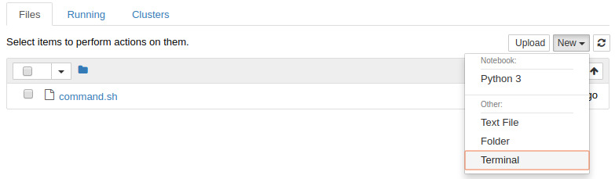
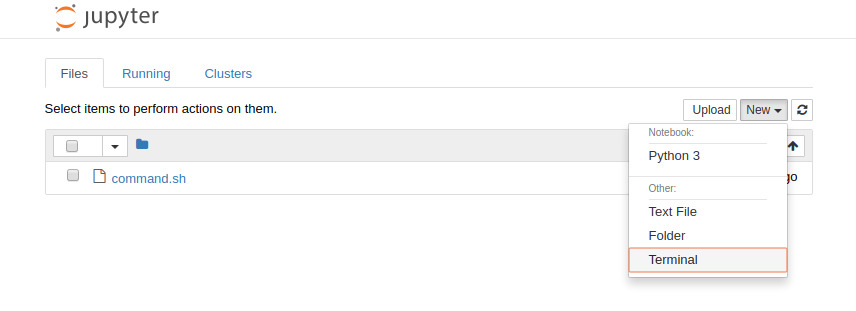
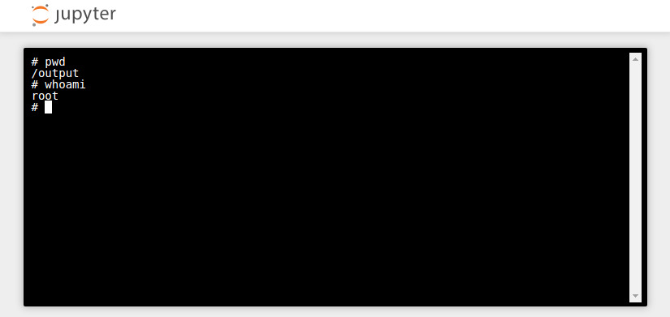

!!! important "Quick Look"
    ```
    $ floyd run --mode jupyter
    ```

    


You can start a bash session into your job's environment by running your job in
Jupyter Notebook mode:

```bash
$ floyd run --mode jupyter
Creating project run. Total upload size: 183.0B
Syncing code ...
[================================] 916/916 - 00:00:00

JOB NAME
--------------------
mckay/projects/ssh/1

Setting up your instance and waiting for Jupyter notebook to become available

Path to jupyter notebook: https://floydhub.com/notebooks/YXau92xMFUshUbMdKqKVVX
```

When you visit your running Jupyter Notebook in the browser, click the `New`
button in the top right corner of the screen and select the `Terminal` option
as shown below:



That button will launch a terminal session in your running instance with root
access:


Currently, FloydHub does not offer true SSH access into instances, but the
method described above is sufficient for what most users want to use SSH.

